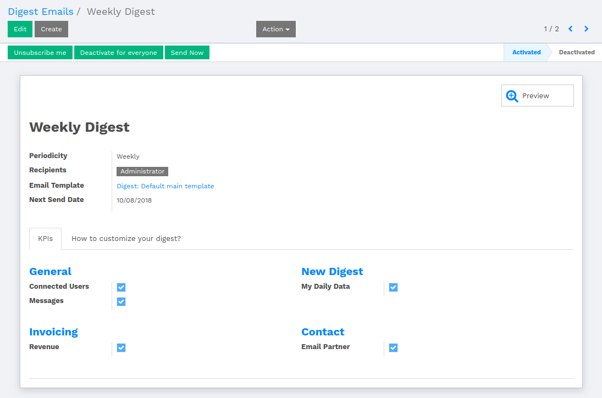
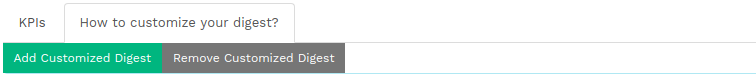
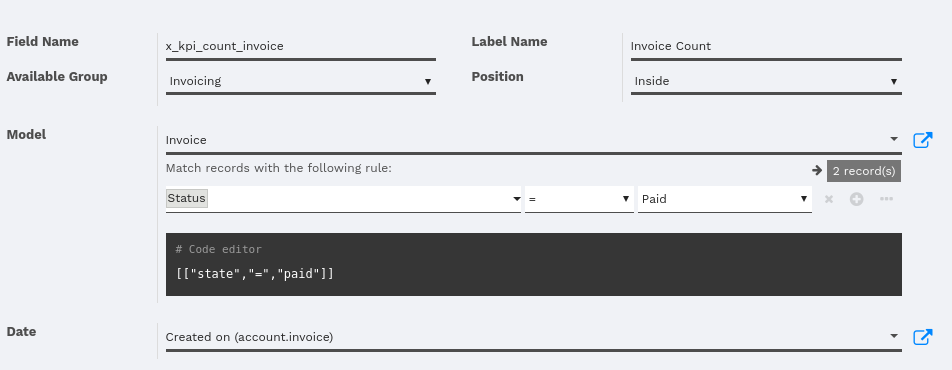
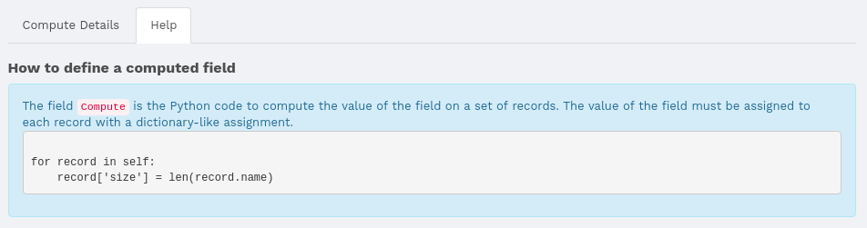
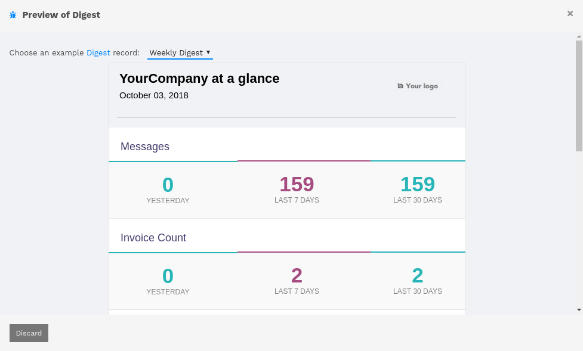
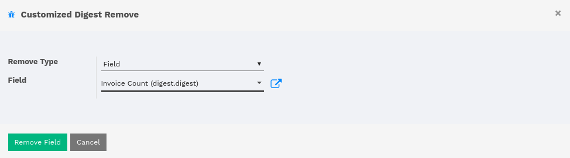

:banner: banners/flectra-kpi-digest.jpg

======
Digest
======

Introduction
============

This module provides the basis for creating key performance indicators,
including static and dynamic thresholds (SQL query or Python code), on
local and remote data sources.

The module also provides the mechanism to update KPIs automatically. A
scheduler is executed every hour and updates the KPI values, based on the
periodicity of each KPI. KPI computation can also be done manually.

Find the menu of KPI Digest from :menuselection:`Settings --> Technical --> Email --> Digest Emails`.

How to create Digest Email
==========================

*   There are four types of periodicity.

    *   Daily
    *   Weekly
    *   Monthly
    *   Quarterly

The periodicity describes it self. Whichever periodicity is selected
will work according to the period. As the user changes the periodicity,
the **Next Send Date** will change according to its time period.

Recipient is the one who receives the emails from the system. The user
can stop getting email from the system by clicking on **Unsubscribe me**
button from the header.

The system provides the default Email Template to show off the digest
data. User can also create their own Email Template.

Under KPIs tab, there are some fields which will be considered as the
source of the data. The user can preview the template by clicking on
the smart button labeled as Preview.

Let's say, If user wants number of connected users, messages, revenue
and email partner then mark the checkbox against that label. Only those
data will be available in preview whichever field is marked as true.

How to customize your digest?
=============================

Under **How to customize your digest?** tab, user is given two buttons
labeled as **Add Customized Digest** and **Remove Customized Digest**
where user can add their own customized digest and can remove their own.

The user is given the instruction to customize the digest under the buttons.

Add Customized Digest
---------------------

By customizing the digest, it will create a field with a type of checkbox,
which will be reflected in the digest report.

The name of the **Compute Field Name** and **Compute Function** will be changed
as the user changes the name under **Field Name** field.

**Label Name** is the label how the field will be labeled with.

The next step is to set the position of the field. The field has to be
inside the group. So the user has to select the group from **Group Name**.
It will only show those groups which are under KPIs tab.

*   There are three positions of the field.

    *   Before
    *   After
    *   Inside

If the user selects **Before** or **After**, that means the user has to
create a new group and will be set according to the position. The field
will be generated inside that newly created group.

.. image:: ./media/before_group.png

If the user selects **Inside**, that means the newly created filed will
be set inside the selected group.

|

The system will retrieve the data according to the filter. To set filter
over data, select the model and add filter by clicking on green button
labeled as **+Add Filter**.

That will allow the user to select the field and the value against it.

The python preview will be shown that how the filter is applied.

the compute field name will be generated based on the field name. The user
is supposed to set the type of the field either it should be **Integer** or
**Monetary**.

.. image:: ./media/custom_digest_1.png

The system will generate the code according to the models and filters, which
creates a compute function and will retrieve the desired data.

.. code-block:: python

    for record in self:
        start, end, company = record._get_kpi_compute_parameters()
        record['x_kpi_count_invoice_value'] = self.env['account.invoice'].search_count([["state","=","paid"],["create_date", ">=", start], ["create_date", "<", end]])

The user is also given the help under **Help** tab, which will help to develop
the compute filed.

Once the procedure is completed, the filed will be added at appropriate and
desired place. The data of that field will be available if the field (checkbox)
is marked as **True**.

Remove Customized Digest
------------------------

The user can remove the unnecessary customized digest. On clicking **Remove Customized Digest**
button, a parametrized window will pop up.

There will be two options under **Remove Type** field, **Group** and **Field**.

If Group is selected, then it is necessary to select the Group under **Available Group**.

If Field is selected, then it is necessary to select the digest field under **Field**.

The system will remove the Group or the Field under the Group from the checkbox list.
