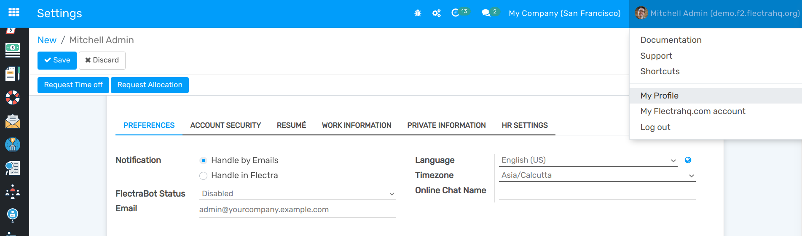
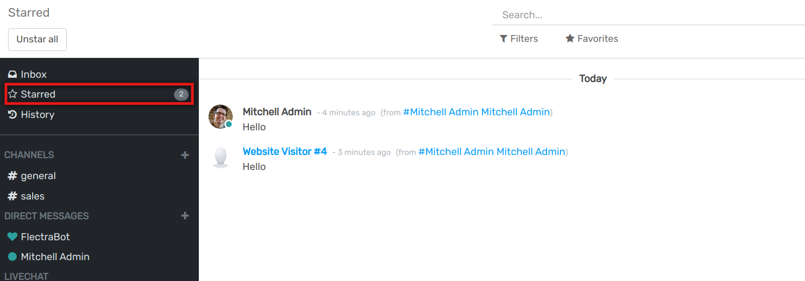
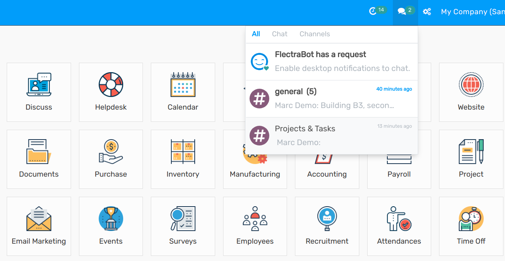
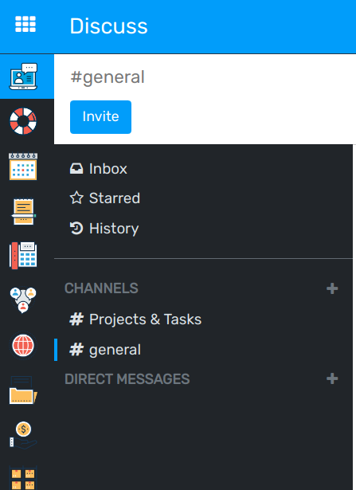
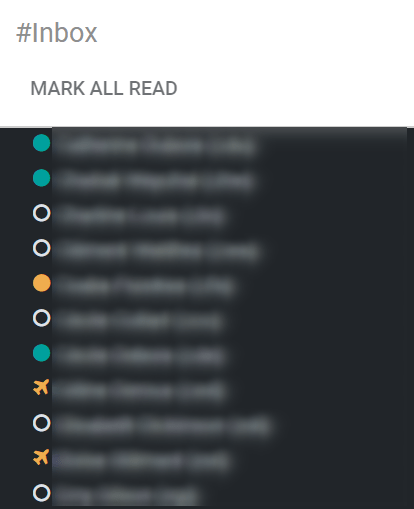

========================
Get Started with Discuss
========================

Discuss allows you to bring all of your company’s communication together through messages, notes,
and chat. Share information, projects, files, prioritize tasks, and stay connected with colleagues
and partners throughout applications. Forge better relationships, increase productivity and
transparency by promoting a convenient way of communicating.

Choose your notifications preference
====================================

Access your *Preferences* and choose how you would like your notifications to be handled.

| By default, the field is set as *Handle by Emails* making messages, notes, and notifications where
  you were mentioned or that you follow, to be sent through email. By choosing *Handle in Flectra*,
  they are shown in the *Inbox*.
| Messages can then be *Marked as Todo*, *Replied*, or *Marked as Read*.

The messages tagged as *Mark as Todo* are also shown in *Starred*, while the ones *Marked as Read*
are moved to *History*.

Start Chatting
==============

The first time you log in to your account, FlectraBot sends you a message asking for permission to
receive desktop notifications to chats. If accepted, you receive push notifications to the messages
sent to you despite of where you are in Flectra.

         notifications for Flectra Discuss

.. tip::
   To stop receiving desktop notifications, reset the notifications settings of your browser.

To start a chat, click on *New Message* on the *Messaging Menu*, or go to *Discuss* and send a
*Direct Message*.

You can also create :doc:`public and private channels <team_communication>`.

Chat status
-----------

It is helpful to see what colleagues are up to and how quickly they can respond to messages by
checking their *Status*. The status is shown on the left side of a contact’s names on Discuss’
sidebar and on the *Messaging menu*.

- Green = online
- Orange = away
- White = offline
- Airplane = out of the office

.. seealso::
   - :doc:`team_communication`
   - :doc:`../advanced/email_servers`
