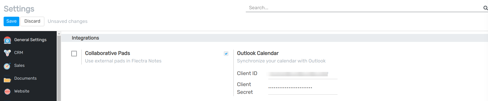
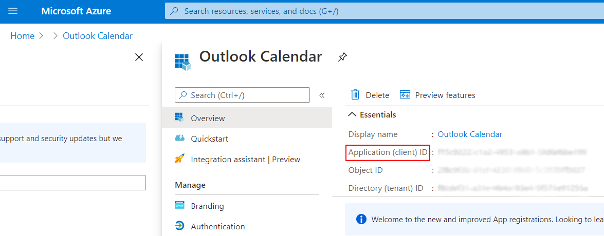
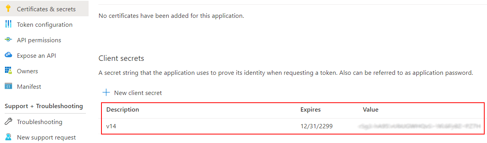
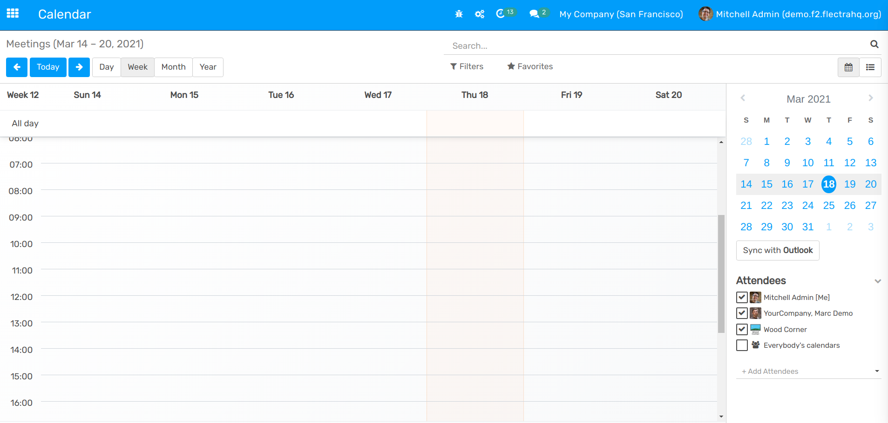
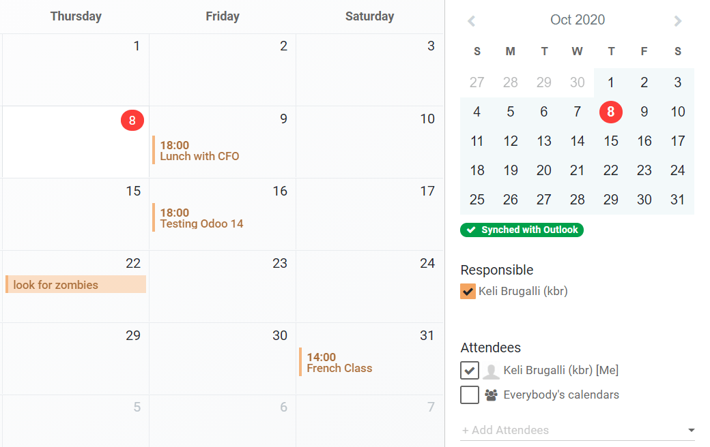

=======================================
Synchronization with Outlook's Calendar
=======================================

Synchronizing your **main** Outlook Calendar with Flectra is useful to keep track of your tasks and
appointments, and across all related applications.

Register your application with the Microsoft identity platform
==============================================================

| In order to be able to sync your Outlook Calendar with Flectra's Calendar, a Microsoft Azure account
  is needed. The creation of an account is free for users that have never tried or paid for Azure.
  For more information, `click here <https://azure.microsoft.com/en-us/free/?WT.mc_id=A261C142F>`_.
| Following, `Set up an Azure AD Tenant <https://docs.microsoft.com/en-us/azure/active-directory/develop/quickstart-create-new-tenant>`_,
  also called environment, which is a representation of an organization, to manage and register apps.
| Ultimately, `Register an Application <https://docs.microsoft.com/en-us/azure/active-directory/develop/quickstart-register-app>`_,
  choosing the appropriate supported account type.

.. note::
   When configuring your platform settings, choose *Web*.

   .. image:: media/platform_configurations.png
      :align: center
      :alt: Adding a platform in Microsoft Azure for Outlook calendar sync in Flectra

.. important::
   | For the **Redirect URI restrictions**, copy your Flectra database URI followed by
     ``/microsoft_account/authentication``. Example:

      .. image:: media/redirect_URIs.png
         :align: center
         :alt: Flectra's database URI that is accepted when microsoft returns authentication

   | For more information on the restrictions and limitations of URIs, `check this page <https://docs.microsoft.com/en-us/azure/active-directory/develop/reply-url>`_.

.. note::
   Regarding credentials, you *must* **Add a client secret**, called *Client Secret* in Flectra, which
   allows Flectra to authenticate itself, requiring no interaction from your side. *Certificates* are
   optional.

Configuration in Flectra
========================

Go to general *Settings* and activate the *Outlook Calendar* feature.

From your Azure portal, under *Overview*, copy your *Application (client) ID*, and paste it to
*Client ID* in Flectra.

Going back to your Azure portal, now under *Certificates & secrets*, copy your *Client Secret Value*
and paste it to *Client Secret* in Flectra.

.. _outlook_calendar/sync_with_outlook:

Sync with Outlook
=================

.. important::
   | Flectra Calendar sends a confirmation email at the creation of an event to its attendees. But, on
     the **first** sync, Outlook will also send confirmation emails of all scheduled events
     (including past ones).
   | To avoid this situation, we recommend *archiving all past events, and removing yourself from
     future ones in Flectra Calendar before the first sync*. This will prevent events from being
     created in Outlook, and therefore, no redundant emails will be sent during the first
     synchronization. After the sync, events will only send one confirmation email.

      .. image:: media/archive_flectracalendar.png
         :align: center
         :alt: Archive events in Flectra Calendar

Go to the *Calendar* application and *Sync with Outlook*. You are asked to log in to
your account, if you are not already, and grant the required permissions.

The synchronization is a two-way process, meaning that events are reconciled in both accounts
(Outlook and Flectra).

.. note::
   All users that want to use the synchronization simply need to :ref:`sync their calendar with
   Outlook <outlook_calendar/sync_with_outlook>`. The configuration of Microsoft's Azure account
   is only done once, as Azure AD tenants' are unique, and represent an organization that helps you
   to manage a specific instance of Microsoft cloud services for your internal and external users.

.. seealso::
   - :doc:`../google/google_calendar_credentials`