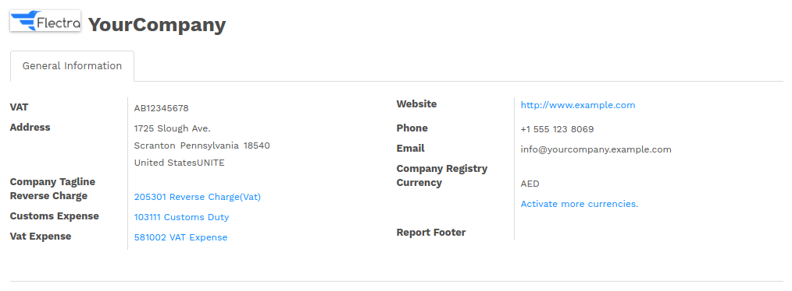
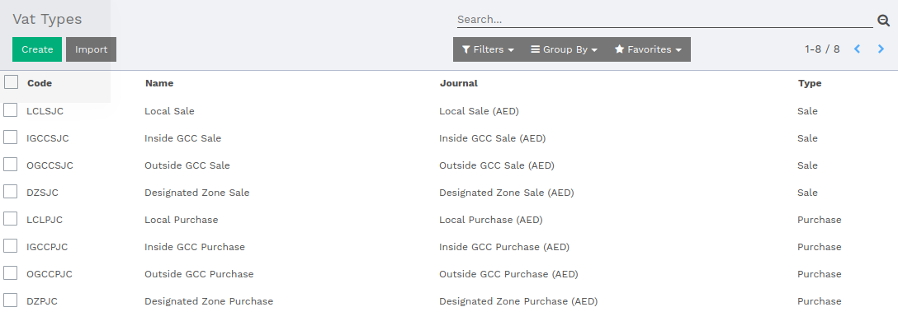
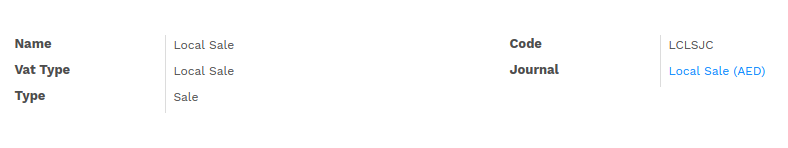
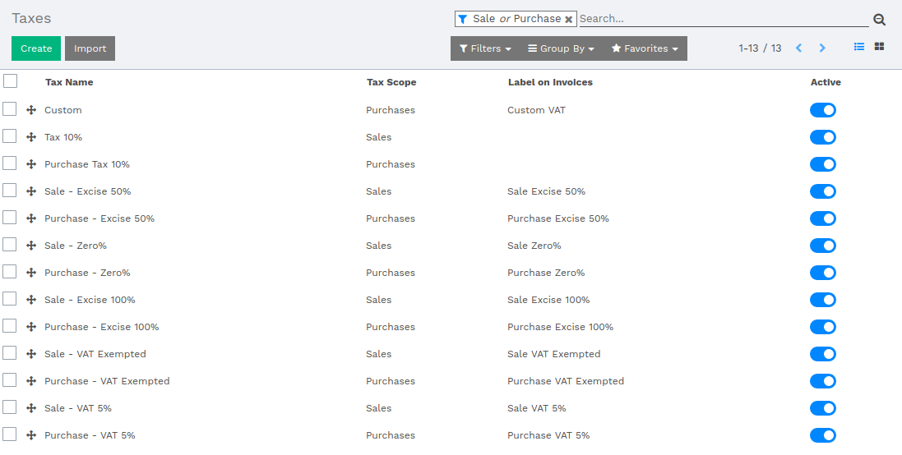
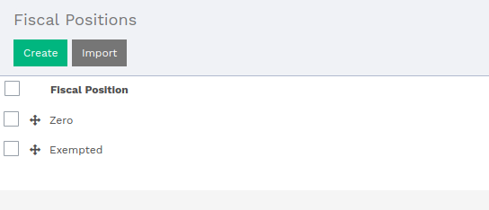
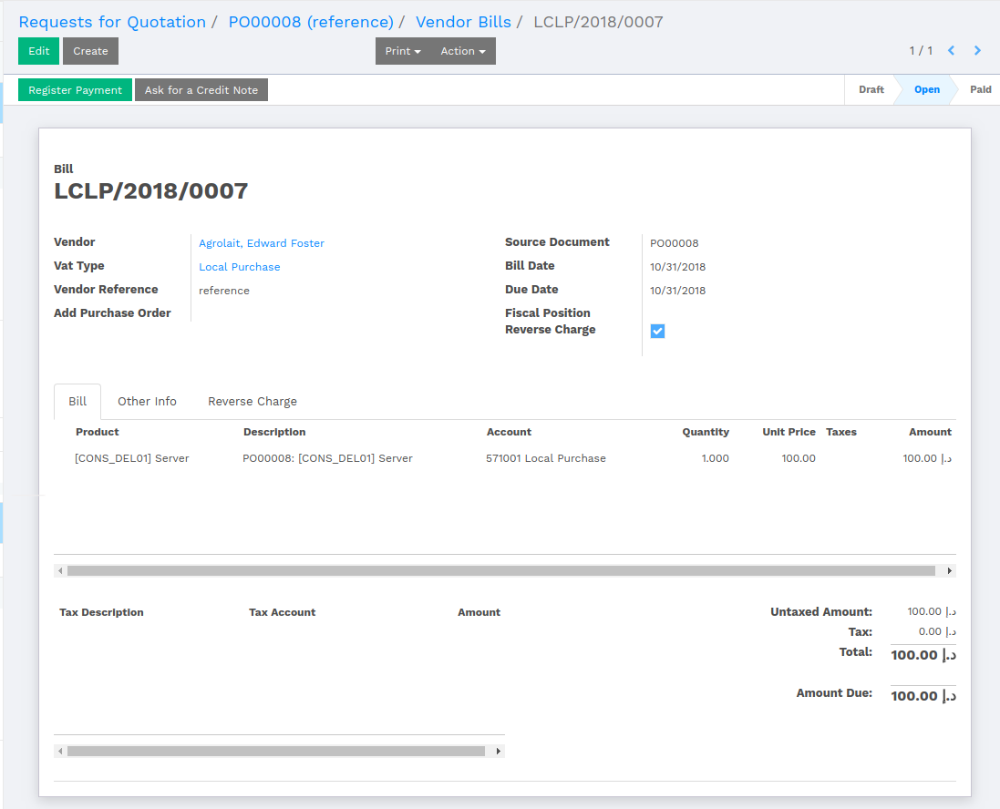
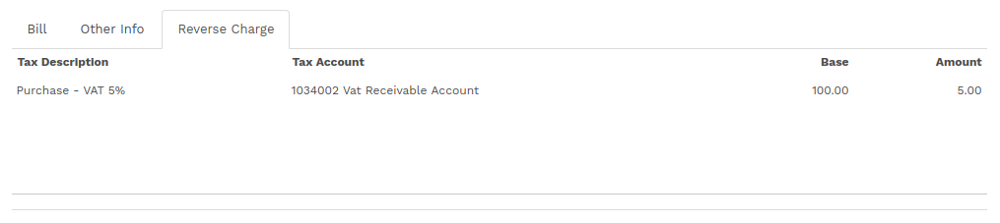
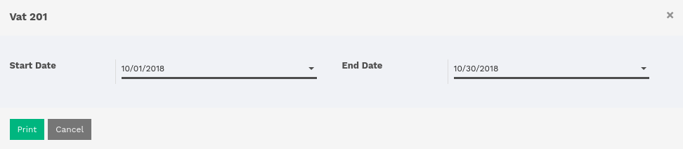
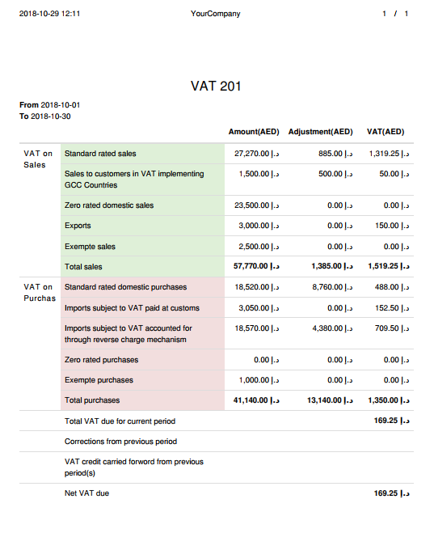

:banner: banners/uae-vat-app-banner.jpg

===========
VAT for UAE
===========

Introduction
============

Company
-------

The user is supposed to set such fields under Company. There are three account fields
where respective accounts are to be set under **Reverse Charge**, **Customs Expense** and
**VAT Expense**.

There is a field labeled as **VAT**, where user is supposed to set VAT number for respective
Company.

VAT Types
---------

VAT Types are bifurcated in two types, Sales and Purchase.

The major purpose of VAT types is to built a standard report, which will gather all records
with its amount according to the VAT Type.

**Sales Type**

*   Local Sale - This type of sales will be displayed in report as **Standard Rated Sales**.
*   Inside GCC Sale - This type of sales will be displayed in report as **Sales to customers in VAT implementing GCC Countries**.
*   Outside GCC Sale - This type of sales will be displayed in report as **Exports**.
*   Designated Zone Sale - This type of sales will be displayed in report as **Zero rated domestic sales**. If zero percent tax is applied over records then that will be included too.

**Purchase Type**

*   Local Purchase - This type of purchase will be displayed in report as **Standard Rated domestic purchases**.
*   Inside GCC Purchase & Outside GCC Purchase - This type of purchase will be displayed in report as **Imports subject to VAT paid at customs**.
*   Designated Zone Purchase - This type of purchase will be displayed in report as **Zero rated purchases**.

The user is supposed to set VAT Type under :menuselection:`Invoicing --> Configuration --> VAT Types`.

In VAT type, the user has to select **VAT Type** and its **Code**. The system has given
number of VAT types.

Select an appropriate **Journal**. The user is supposed to select the **Type** either Sale or
Purchase.

Taxes
=====

Flectra provides these many pre-defined taxes.

Fiscal Year
===========

This module provides two fiscal year.

Reverse Charge Mechanism
========================

While creating a Purchase Order with marking Reverse Charge, it will be reflected in the
Vendor Bill of related PO.

In Vendor Bill, a new tab will be visible labeled as **Reverse Charge**, which will be having
the tax description of the bill.

Once the Vendor Bill is validated, the system will separate the tax from the product line
and will show up under **Reverse Charge** tab.

Report
======

The user can have a report from :menuselection:`Invoicing --> Reporting --> PDF Reports --> VAT 201`.

Clicking over **VAT 201**, the system will open up a window with parameters.

The user is supposed to set the date range, where the system will retrieve records which falls between
the given date range.

In the report, the column **Amount(AED)** shows the amount without tax. The **Adjustment(AED)** show
the amount of the product which is returned. The **VAT(AED)** column show the final tax
applied over the sold products.

