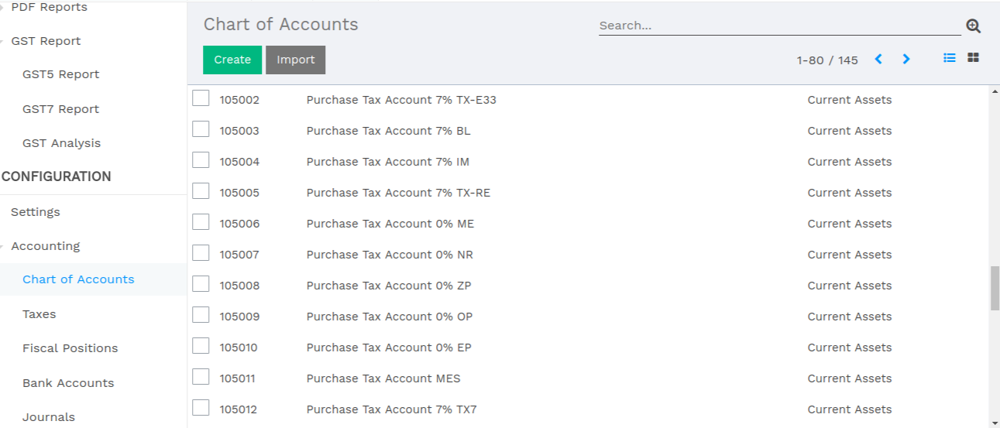
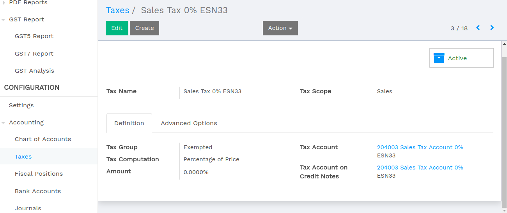
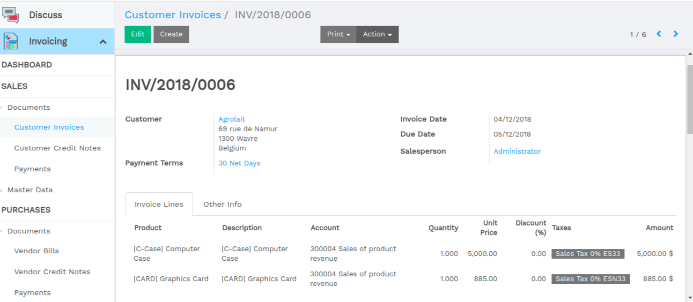
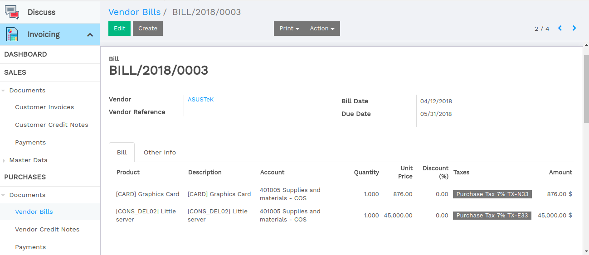
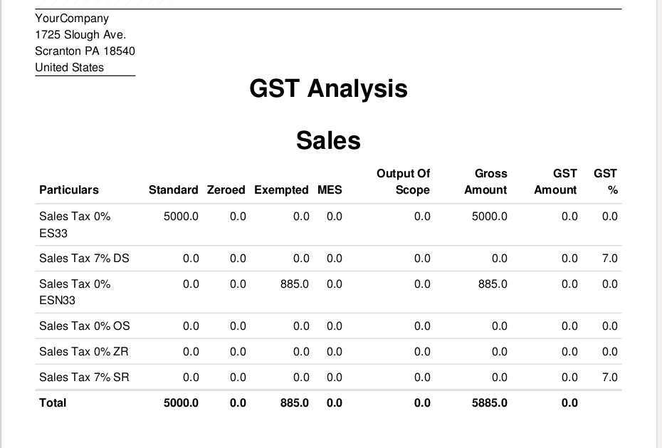
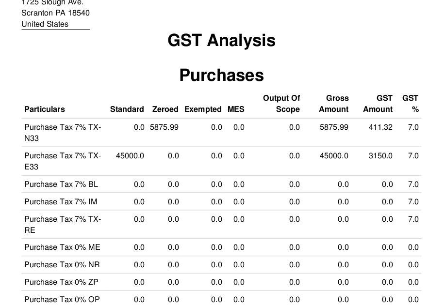
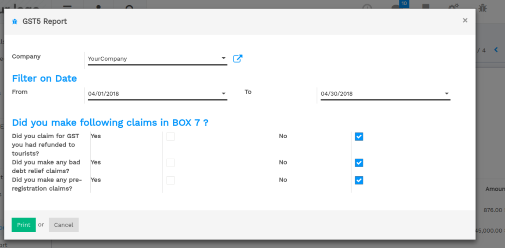
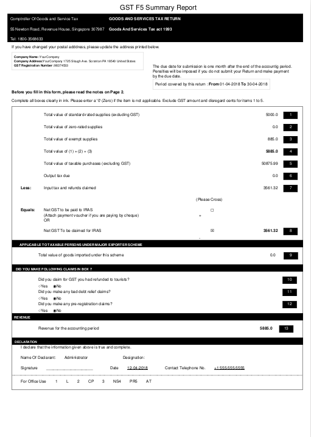
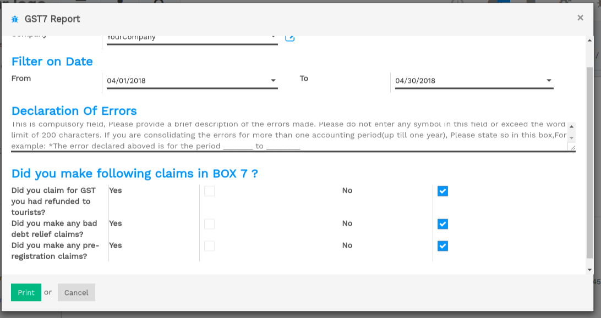
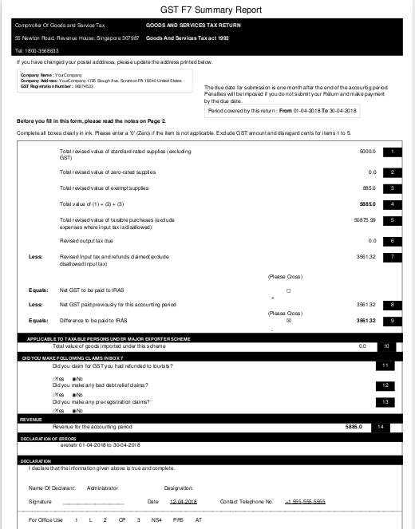

:banner: banners/l10n_sg_gst.jpg

========================================
GST Reporting for Singapore Localization
========================================

Chart of Accounts for GST Singapore
===================================

Tax Accounts configuration based on Singapore Accounting.

Tax Categories
==============

Categorize your tax codes into five categories by selecting proper value:
    * Standard Rates
    * Zeroed
    * Exempted
    * MES
    * Out Of Scope

Set Tax group = 'Zeroed' for Purchase Tax 7% TX-N33.

Set Tax group = 'Out Of Scope' for Sales Tax 0% OS.

Customer Invoice
================
Customer Invoice with Taxes as per Singapore Localization.

Supplier Invoice
================

Supplier Invoice with Taxes as per Singapore Localization.

GST Analysis Report
===================

GST-F5 Summary Report
=====================

The GST-F5 report includes details such as standard-rated, zero-rated, and exempted, out of scope,  mes, purchases and sales in a regulated format.

GST-F7 Summary Report
=====================

If you have made errors in your submitted GST F5 forms, you should file GST-F7  to correct the errors.

