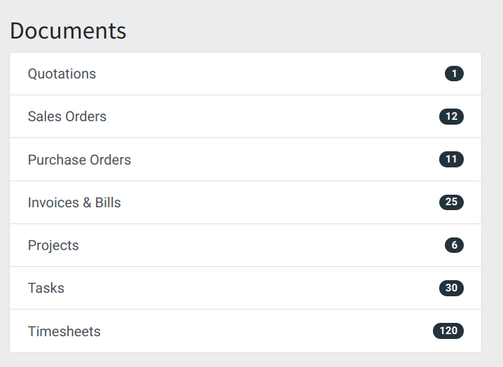
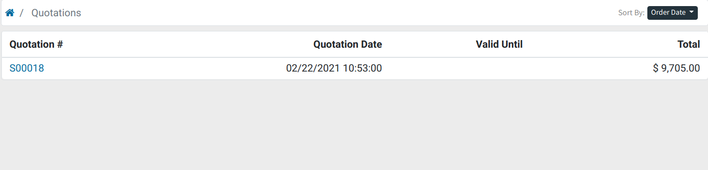
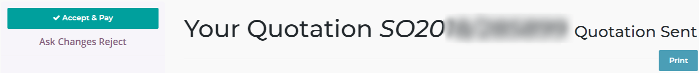
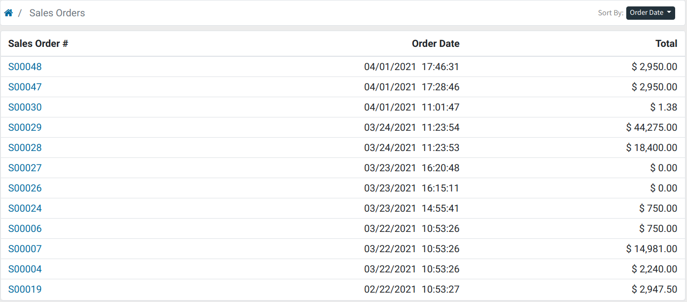
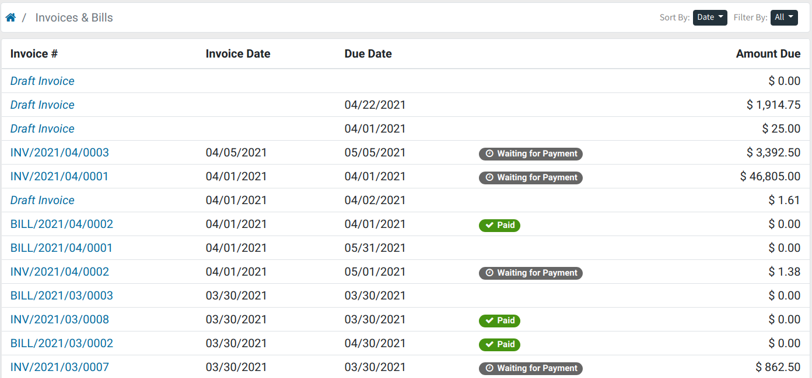

:banner: banners/my_flectra_portal.png

=================
My Flectra Portal
=================

My Flectra Portal
=================

In this section of the portal, you will find all the communications between you
and Flectra: documents such as quotations, sales orders, invoices and subscriptions.

.. note::
   To access this section, you have to log with your username and password to `Flectra
   <https://www.flectrahq.com/my/home>`_. If you are already logged in, just click on your name on the
   top-right corner and select "My Account".

Quotations
----------

Here you will find all the quotations sent to you by Flectra. For example, a
quotation can be generated for you after adding an application or a user to your
database or if your contract has to be renewed.

The *Valid Until* column shows the date through which the quotation is valid; after that date,
the quotation will be "Expired". By clicking on the quotation, you will see all
the details of the offer, such as the pricing and other useful information.

If you want to accept the quotation, just click "Accept & Pay," and the quote
will get confirmed. If you don't want to accept it, or you need to ask for some
modifications, click on "Ask Changes Reject."

Sales Orders
------------

All your purchases within Flectra (Upsells, Themes, Applications, etc.)
will be registered under this section.

By clicking on the sale order, you can review the details of the products purchased
and process the payment.

Invoices
--------

All the invoices of your subscriptions and/or sales orders will be
shown in this section. The tag before the Amount Due will indicate if the
invoice has been paid.

Just click on the invoice if you wish to see more information, pay the invoice,
or download a PDF version of the document.

Delete your Flectra.com account
===============================

In order to delete your Flectra.com account, you have to reach out to our `Support Services <https://www.flectrahq.com/help>`_. 

.. warning::
    If you wish instead to formally request the deletion of all the information connected to your email address as per the European Union General Data Protection Regulation (GDPR), please send an email to privacy@flectra.com. 

