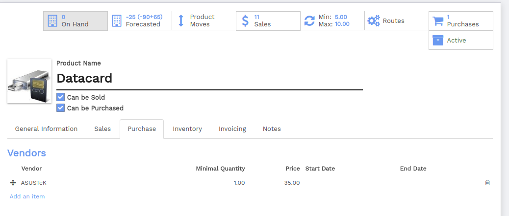
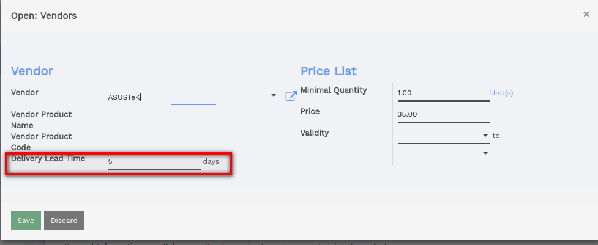
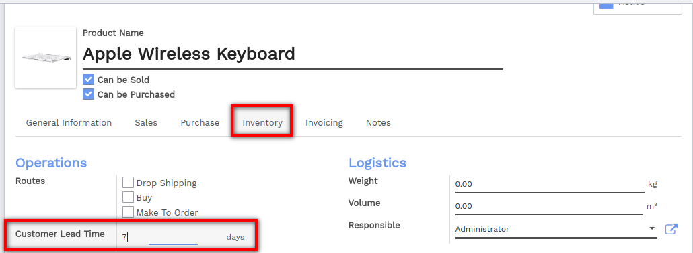
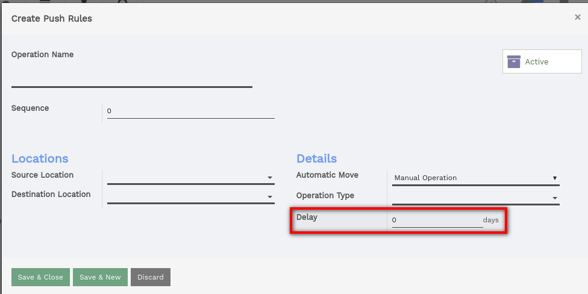

====================================================
How are the order date and scheduled dates computed?
====================================================

Scheduled dates are computed in order to be able to plan deliveries,
receptions and so on. Depending on the habits of your company, Flectra
automatically generates scheduled dates via the scheduler. The Flectra
scheduler computes everything per line, whether it's a manufacturing
order, a delivery order, a sale order, etc. The dates that are computed
are dependent on the different leads times configured in Flectra.

Configuring lead times
======================

Configuring **lead times** is an essential move in order to compute
scheduled dates. Lead times are the delays (in term of delivery,
manufacturing, ...) promised to your different partners and/or clients.
Configuration of the different lead times are made as follows:

On a product level
------------------

Supplier lead time:
~~~~~~~~~~~~~~~~~~~

The supplier lead time is the time needed for the supplier to deliver
your purchased product. To configure the Supplier lead time select a
product (from the Purchase module, go to :menuselection:`Purchase --> Product`),
and go in the **Inventory** tab. You will have to 
add a **Vendor** to your product in order to select a supplier lead time.

.. tip:: 
    It is possible to add more than one vendor per product and thus 
    different delivery lead times depending on the vendor.

Once a vendor is selected, click on it to open its form and indicate its
delivery lead time. 

.. note:: 
    In this case security days have no influence, the scheduled 
    delivery days will be equal to: Date of the purchase order + Delivery Lead Time.

Customer lead time
~~~~~~~~~~~~~~~~~~

The customer lead time is the time needed to get your product from your
store/warehouse to your customer. It can be configured for any
product. Simply select a product (from the **Sales** module, go to 
:menuselection:`Sales --> Product`), 
and go into the **Sales** tab to indicate your customer lead time.

On route level
--------------

The internal transfers due to the movement of stocks can also influence
the computed date.

The delays due to internal transfers can be specified in the **Inventory**
module when creating a new push rule for a new route.

.. note:: 
    Read the documentation 
    :doc:`../../../../inventory/routes/concepts/push_rule`
    to learn more.

