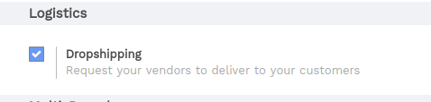
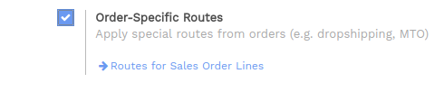
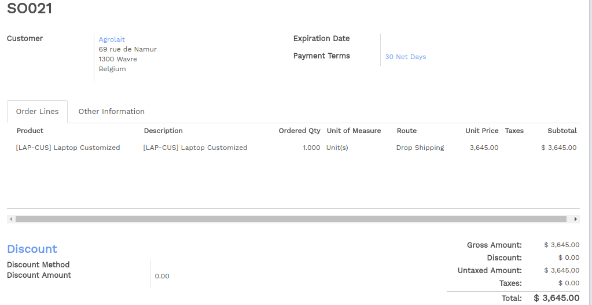

===========================
How to setup drop-shipping?
===========================

Overview
========

Drop shipping allows to deliver the goods directly from the supplier to
the customer. It means that the products does not transit through your
stock.

Configuration
=============

First, configure the **Routes** and **Dropshipping**. Go to 
:menuselection:`Purchase --> Configuration --> Settings`.
Check **Dropshipping** section.

You have to allow the choice of the route on the sale order. Go to the
**Sales** application, :menuselection:`Configuration --> Settings` and 
tick **Order-Specific Routes**.

How to use drop-shipping? 
=========================

Create the sale order and select the route as **Dropshipping** on the
concerned order lines.

Once the order has been confirmed, no move will be created from your
stock. The goods will be delivered directly from your vendor to your
customer.

.. note::
    In order to be able to invoice the delivery, you must set the
    invoice policy of your product on **Ordered quantities**.
