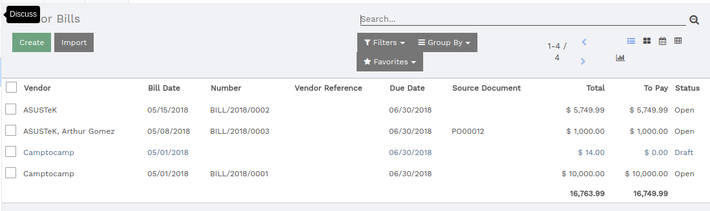
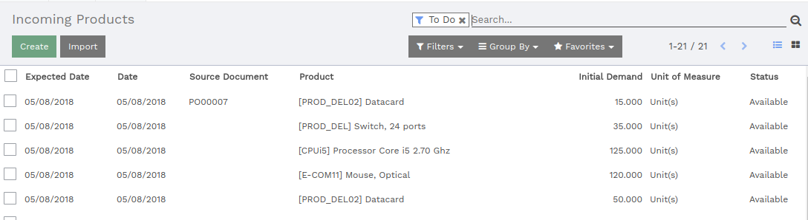

=============================================
How to check that everything is working fine?
=============================================

Vendor Bills
============

Even if you don't have the rights to the accounting application, you can
still control the vendor bills.

Go to the **Purchases** application: :menuselection:`Control --> Vendor Bills`.

Incoming Products
=================

Even if you don't have the rights to the inventory application, you can
still control the incoming products.

Go to the **Purchases** application: :menuselection:`Control --> Incoming Products`.

