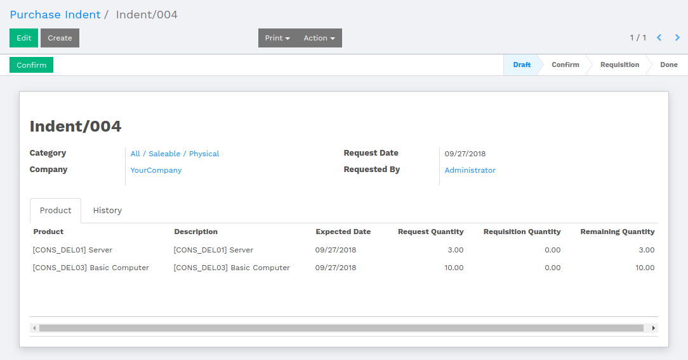
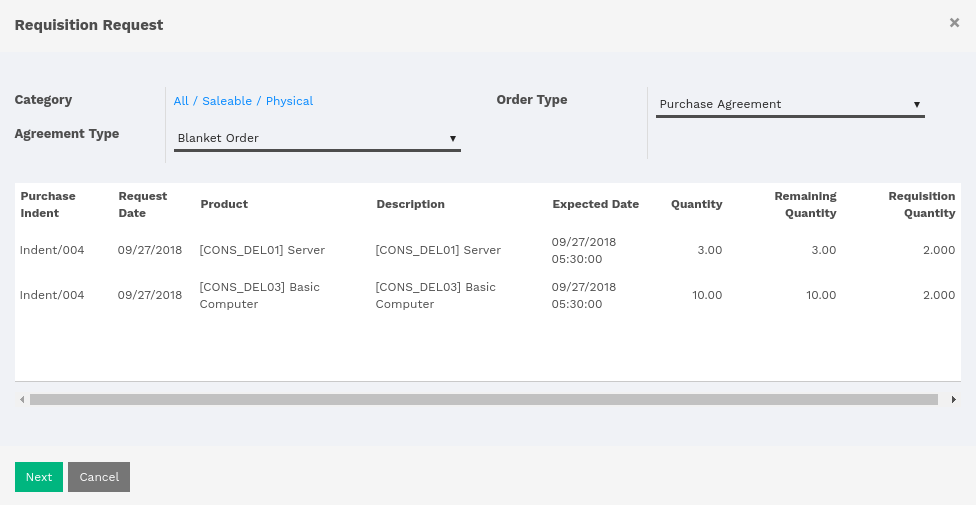
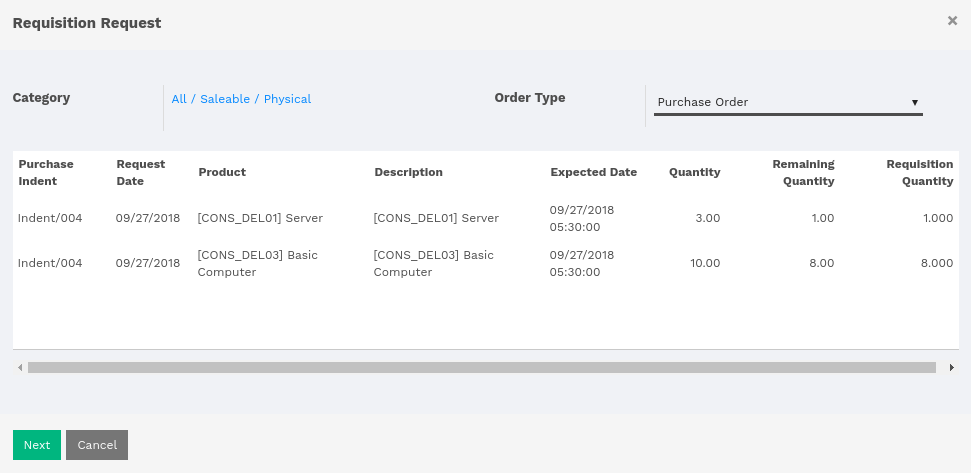
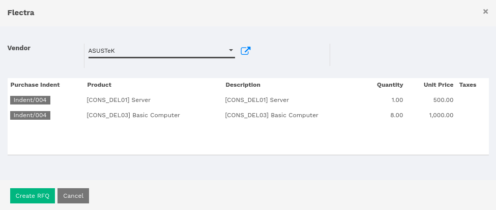
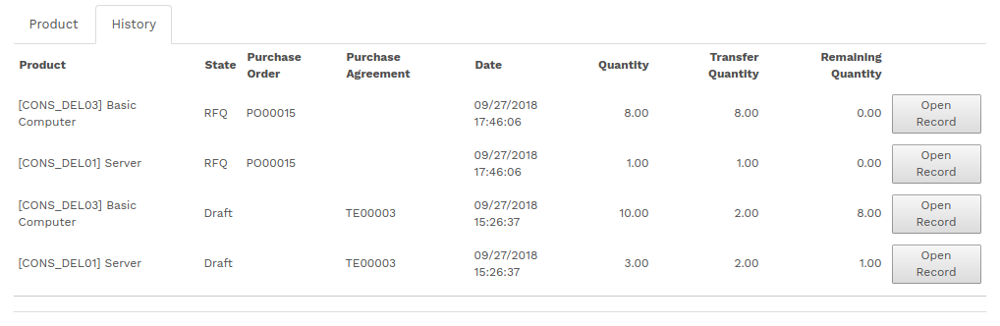
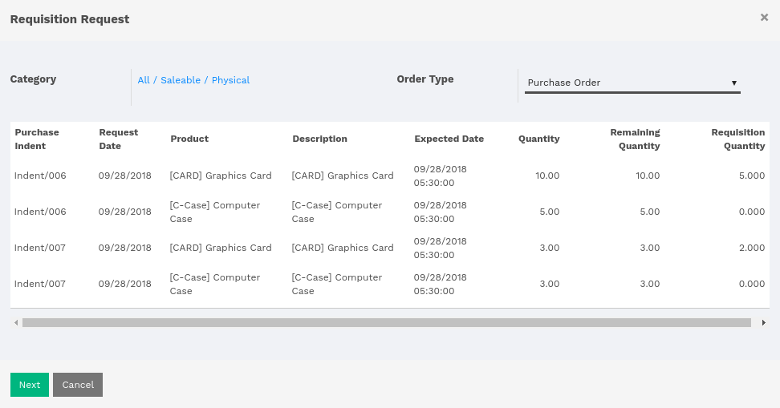
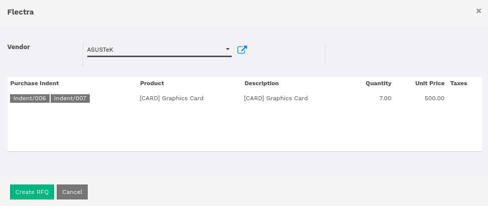

:banner: banners/flectra-purchase-indent.jpg

===============
Purchase Indent
===============

Introduction
============

An internal company document used in the purchasing process to authorize the
requisition of materials prior to initiating a purchase order. Purchase indents
are audit documents used to track the movement of materials prior to their
receipt by the buyer.

Purchase Indent
===============

Order Type - Purchase Agreement
-------------------------------

In order to create Purchase Indent, the user is given a menu under
:menuselection:`Purchase --> Purchase Indent`.

Select a product category, which will be used in filtering products by selected category.
Only those products will be listed under products which belong to the selected category.
The user is supposed to set the number of quantity under **Request Quantity** column.

.. note::
    Once the Purchase Indent is confirmed, the user will not be able to modify the document.

Button labeled as 'Create Requisition' will appear once the Purchase Indent is confirmed.
By clicking over 'Create Requisition', the system will pop up a parametric window, which
allows user to create requisition request.

Here, the user is supposed to select any of order types, either the Purchase Order or Purchase Agreement.

Selecting Purchase Order, the user will be given another option of selecting Agreement Type,
either Blanket Order or Purchase Tender.

The user is supposed to set the number of Requisition Quantity unto Remaining Quantity.
The quantity must be greater than zero.

By clicking next, another window will pop up showing details of product requisition.
Either the user can create a purchase agreement or can cancel the process.

Once the user clicks on 'Create Purchase Agreement', the system will show a smart button,
which redirects to the Purchase Requisition.

From Purchase Requisition, the default purchase flow is to be followed.

.. seealso::
    * :doc:`../../purchase/purchases/tender/manage_blanket_orders`
    * :doc:`../../purchase/purchases/tender/manage_multiple_offers`

.. note::
    If the user selects the 'Purchase Tender' agreement type, then the flow remains the
    same as directed above.
    For Purchase Tender, refer the above link.

Order Type - Purchase Order
---------------------------

There are some products remain in product requisition.

Now, while creating a requisition, select the order type 'Purchase Order' and fill
in the number of quantity under Requisition Quantity.

By clicking over 'Next', the user is supposed to select the Vendor and has to key
in **Unit Price** and **Taxes**, and click over **Create RFQ**.

Here, the created purchase order will be created and there is a smart button labeled
as **Purchases**, which will redirect to the number of purchase orders created for
the current purchase indent.

The Purchase Indent maintains the history of purchase orders and purchase requisitions.

.. note::
    Now on, the Purchase Order workflow will be applied.
    For Purchase order, refer the below link.

.. seealso::
    * :doc:`../../purchase`

.. note::
    If Purchase Order or Purchase Agreement is cancelled then the quantity will be updated
    in Purchase Indent.

What if there are purchase indent with same products
====================================================

The scenario, where there are two or more purchase indent created and such products
are common among them. The system will club all those common products from confirmed
purchase indents while creating a requisition.

In the above image, the user can see that there are product lines with different purchase
indents references.

Whichever line is affected while creating requisition will create history in respective
purchase indent.  If the purchase order or purchase agreement is cancelled, then the quantity
of respective purchase indent will be updated.

While after clicking over **Next** button, the system will add up the quantity of all
those same products with different number of quantity.

In requisition request, the **Graphics Card** is having the number of quantity of 5 and 2
respectively. So the system will merge up the number of quantity while creating purchase
order or purchase agreement.
