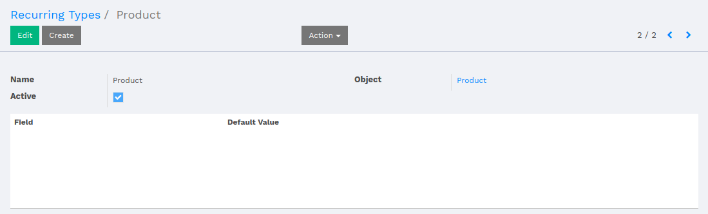
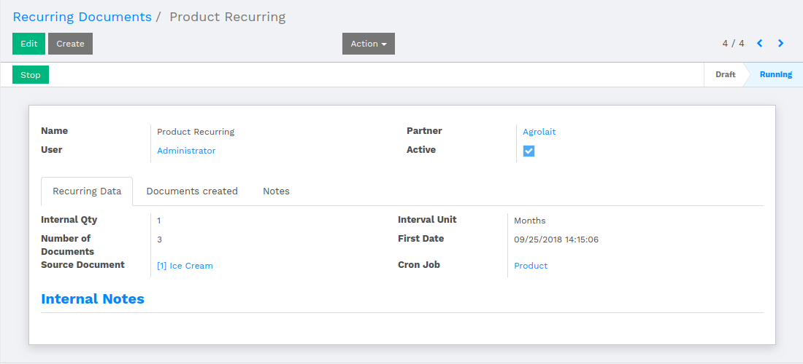
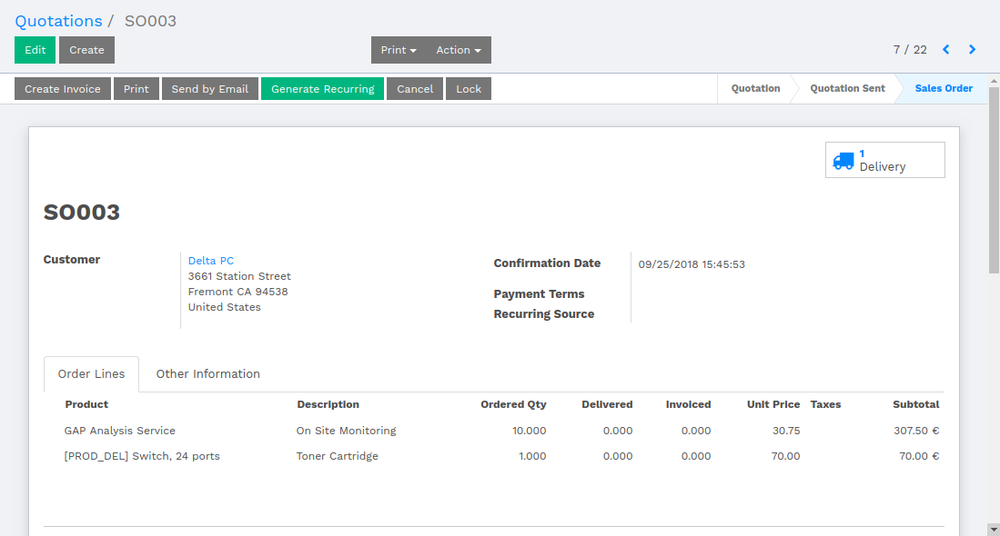
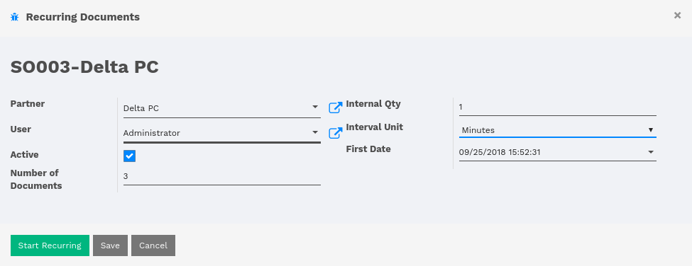
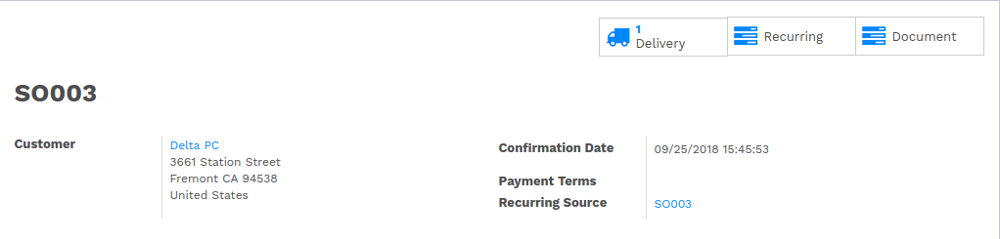
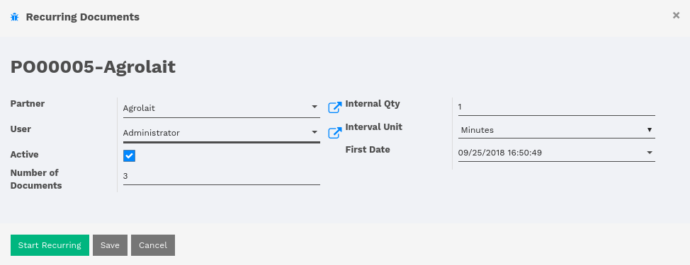
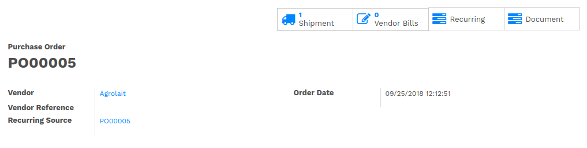
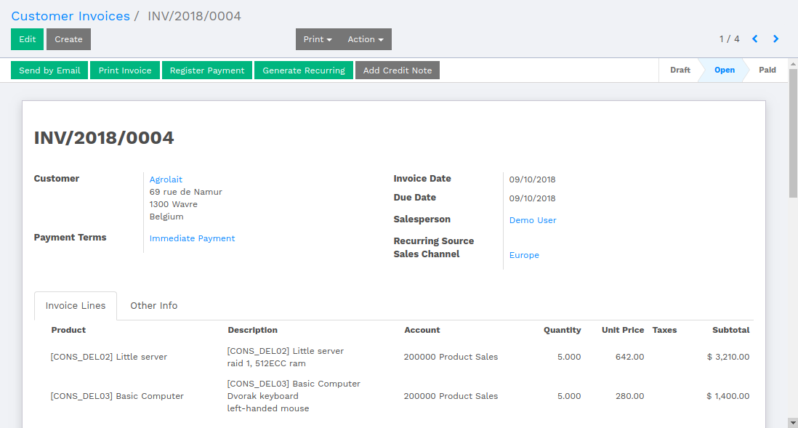
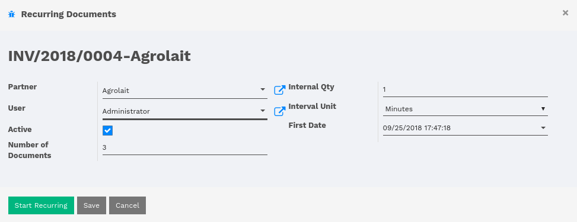
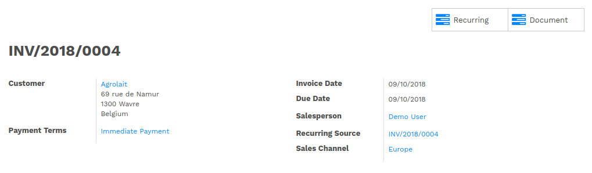

:banner: banners/flectra-recurring-documents.jpg

===================
Recurring Documents
===================

Introduction
============

The recurring documents module gives facility of generating documents
automatically based on configurations.

*   There are certain modules available in Flectra for generating documents,
    which are as follows.

    *   Recurring Documents
    *   Sale Order Recurring
    *   Purchase Order Recurring
    *   Account Invoice Recurring

Recurring Documents
===================

Using this module, the system will allow users to generate documents for any particular
module (Installed Modules). There are one time configuration steps to follow.

*   There are two configurations menus under :menuselection:`Settings --> Technical --> Automation`.

    1.  Recurring Types
    2.  Recurring Documents

Recurring Types
---------------

The user is supposed to create a recurring type for particular model.

Set the name of the recurring type, select module for which the recurring document
is being created.

If user want to set fields with default values, then select fields pertaining to the
selected model and set value against the field.

Recurring Documents
-------------------

Recurring Document is used to configure the scheduler.

Set the name of the Recurring Document, select the partner for which the document is
to be created. Interval Qty is how many times the scheduler should be executed.
The available interval units are Minutes, Hours, Days, Weeks and Months.

*   Recurring Data

    -   Number of Documents indicates that how many number of documents should be generated
        in one interval.

    -   Source Documents, where user has to select the record for which the Documents will be created.

    -   First Date is the date when the first document is going to be created.

    -   Once the user saves the Recurring Document, user will be able to see a button in
        header labeled as Process. By clicking over the 'Process', the scheduler will start
        the execution and the cron for current Recurring Document will be created and set under
        Cron Job field.

*   Documents Created

    -   Here, the system keeps the history of created documents in each interval.

*   Notes

    -   Here, the user can add description about current Recurrent Document.

.. note::
    In Sale Order Recurring, Purchase Order Recurring and Account Invoice Recurring; the user has
    to just click 'Generate Recurring' button and recurring type and recurring document will
    automatically be generated.

Sale Order Recurring
====================

While the user creates Quotation and confirms the sale order, the user will be
able to see a button labeled as 'Generate Recurring'.

By clicking over 'Generate Recurring', it will pop up a window with configuration
parameters of Recurring Documents.

Set value into the fields according to the document and click over 'Start Recurring'.
By clicking on 'Save' button, the user can save the Recurring process, and can start
recurring whenever required.

Once the recurring is generated, the Recurring Document and Recurring Type will be created
for the current Sale Order.

By starting the Recurring, two smart buttons will appear indicating Recurring Document and
number of Documents generated for current Sale Order.

.. note::
    The Recurring Source field in Sale Order indicates that the current Sale Order
    belongs to the Recurring Source.

Purchase Order Recurring
========================

While the user creates Purchase Order and confirms the PO, the user will be able to see
a button labeled as 'Generate Recurring'.

.. image:: ./media/purchase_order.png

By clicking over 'Generate Recurring', it will pop up a window with configuration
parameters of Recurring Documents.

Set value into the fields according to the document and click over 'Start Recurring'.
By clicking on 'Save' button, the user can save the Recurring process, and can start
recurring whenever required.

Once the recurring is generated, the Recurring Document and Recurring Type will be created
for the current Purchase Order.

By starting the Recurring, two smart buttons will appear indicating Recurring Document and number of Documents
generated for current Purchase Order.

.. note::
    The Recurring Source field in Purchase Order indicates that the current Purchase Order
    belongs to the Recurring Source.

Account Invoice Recurring
=========================

While the user creates Customer Invoice or Vendor Bill and validates the document, the
user will be able to see a button labeled as 'Generate Recurring'.

By clicking over 'Generate Recurring', it will pop up a window with configuration
parameters of Recurring Documents.

Set value into the fields according to the document and click over 'Start Recurring'.
By clicking on 'Save' button, the user can save the Recurring process, and can start
recurring whenever required.

Once the recurring is generated, the Recurring Document and Recurring Type will be created
for the current Customer Invoice or Vendor Bill.

By starting the Recurring, two smart buttons will appear indicating Recurring Document and number of Documents
generated for current Customer Invoice or Vendor Bill.

.. note::
    The Recurring Source field in Customer Invoice or Vendor Bill indicates that the current
    Invoice/Bill belongs to the Recurring Source.
