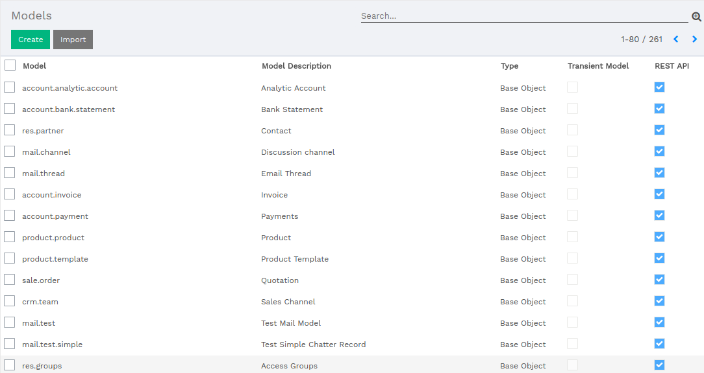

:banner: banners/flectra-rest-api.jpg

========
REST API
========

Introduction
============

Token generation is an essential process, which will be used further in
deletion of token; requesting database for creating, updating, deleting and fetching data.

Create Token
============

The following procedure is to create token.

+-------------------------+--------------------------+
|Parameter                |Description               |
+=========================+==========================+
|username                 |Your account email        |
+-------------------------+--------------------------+
|password                 |Your account password     |
+-------------------------+--------------------------+
|db                       |Specify the Database name |
+-------------------------+--------------------------+

.. code-block:: python

    import requests

    db_config = {
        "username": "YOUR_EMAIL",
        "password": "YOUR_PASSWORD",
        "db": "SERVER_DATABASE_NAME"
    }

    server_url = "YOUR_SERVER_URL"
    get_token_url = "/api/auth/get_tokens"
    url = server_url + get_token_url

    requests.post(url=url, data=db_config)

    # Output:

    {
        "company_id": 1,
        "user_context": {
                "lang": "en_US",
                "tz": "Asia/Kolkata",
                "uid": 1
            },
        "access_token": "YOUR_API_ACCESS_TOKEN",
        "expires_in": "600",
        "uid": 1
    }

Delete Token
============

+-------------------------+--------------------------+
|Parameter                |Description               |
+=========================+==========================+
|access_token             |Your API Access Token     |
+-------------------------+--------------------------+

.. code-block:: python

    import requests

    header = {
        "access_token": "YOUR_API_ACCESS_TOKEN"
    }
    server_url = "YOUR_SERVER_URL"
    del_token_url = "/api/auth/delete_tokens"
    url = server_url + del_token_url

    requests.post(url=url, headers=header)

    # Output:
    {
        "desc": "Token Successfully Deleted",
        "delete": true
    }

Create Record
=============
**Header Parameter**

+-------------------------+--------------------------+
|Parameter                |Description               |
+=========================+==========================+
|access_token             |Your API Access Token     |
+-------------------------+--------------------------+

**Data Parameter**

+-------------------------+----------------------------------------+
|Parameter                |Description                             |
+=========================+========================================+
|fields                   |N number of fields for creating records |
+-------------------------+----------------------------------------+

HTTP POST URL ``'/api/<MODEL NAME>'``

.. code-block:: python

    import requests

    header = {
        "access_token": "YOUR_API_ACCESS_TOKEN"
    }

    data = {
        "name": "FlectraHQ",
        "email": "example@flectrahq.com",
        "website": "www.flectrahq.com"
    }

    server_url = "YOUR_SERVER_URL"
    post_url = '/api/res.partner'
    url = server_url + post_url

    requests.post(url=url, data=data, headers=header)

    # output:
    {
        "id": 300
    }

Get Data
========

Get Request for Single Record
-----------------------------

**Header Parameter**

+-------------------------+--------------------------+
|Parameter                |Description               |
+=========================+==========================+
|access_token             |Your API Access Token     |
+-------------------------+--------------------------+

**Data Parameter**

+-------------------------+----------------------------------------+
|Parameter                |Description                             |
+=========================+========================================+
|fields                   |N number of fields for creating records |
+-------------------------+----------------------------------------+

HTTP POST URL ``'/api/<MODEL NAME>'``

.. code-block:: python

    """

    "field"   : [List of Field(s) in String]
                eg. "['name', 'email', ..]",

    """

    import requests

    header = {
        "access_token": "YOUR_API_ACCESS_TOKEN"
    }
    data={
        "field": "['name', 'email']",
    }
    server_url = "YOUR_SERVER_URL"
    get_url = '/api/res.partner/1'
    url = server_url + get_url

    requests.get(url=url, data=data, headers=header)

    # Output:
    [
        {
            "email": "info@yourcompany.example.com",
            "name": "YourCompany",
            "id": 1
        }
    ]

Get Request for Multiple Record
-------------------------------

**Header Parameter**

+-------------------------+--------------------------+
|Parameter                |Description               |
+=========================+==========================+
|access_token             |Your API Access Token     |
+-------------------------+--------------------------+

**Data Parameter**

+-------------------------+----------------------------------------+
|Parameter                |Description                             |
+=========================+========================================+
|fields                   |N number of fields for creating records |
+-------------------------+----------------------------------------+

HTTP POST URL ``'/api/<MODEL NAME>'``

.. code-block:: python

    """

    "limit"   : Integer eg. 10,
    "field"   : [List of Field(s) in String]
                eg. "['name', 'email', ..]",
    "order"   : "String" eg. "name asc/desc",
    "offset"  : Integer eg. 3,
    "filters" : [List of Condition(s) in String]
                eg. "[('name', 'like', 'XXX'), ..]"

    """

    import requests

    header = {
        "access_token": "YOUR_API_ACCESS_TOKEN"
    }
    data={
        "limit": 3,
        "field": "['name', 'email']",
        "order": 'name desc'
    }
    server_url = "YOUR_SERVER_URL"
    get_url = '/api/res.partner'
    url = server_url + get_url

    requests.get(url=url, data=data, headers=header)

    # Output:
    {
        "count": 3,
        "results": [
            {
                "email": false,
                "id": 44,
                "name": "Your Company"
            },
            {
                "email": "info@yourcompany.example.com",
                "id": 1,
                "name": "YourCompany"
            },
            {
                "email": "william.jackson@jackson.example.com",
                "id": 33,
                "name": "William Thomas"
            }
        ]
    }

Update Record
=============

**Header Parameter**

+-------------------------+--------------------------+
|Parameter                |Description               |
+=========================+==========================+
|access_token             |Your API Access Token     |
+-------------------------+--------------------------+

**Data Parameter**

+-------------------------+----------------------------------------+
|Parameter                |Description                             |
+=========================+========================================+
|fields                   |N number of fields for creating records |
+-------------------------+----------------------------------------+

HTTP POST URL ``'/api/<MODEL NAME>'``

.. code-block:: python

    import requests

    header = {
        "access_token": "YOUR_API_ACCESS_TOKEN"
    }
    data={
        "name": "FlectraHQ",
        "email": "example@flectrahq.com",
        "website": "www.flectrahq.com"
        "id": 300
    }
    server_url = "YOUR_SERVER_URL"
    put_url = '/api/res.partner'
    url = server_url + put_url

    requests.put(url=url, data=data, headers=header)

    # Output:
    {
        "desc": "Record Updated successfully!",
        "update": true
    }

Delete Record
=============

**Header Parameter**

+-------------------------+--------------------------+
|Parameter                |Description               |
+=========================+==========================+
|access_token             |Your API Access Token     |
+-------------------------+--------------------------+

**Data Parameter**

+-------------------------+----------------------------------------+
|Parameter                |Description                             |
+=========================+========================================+
|fields                   |N number of fields for creating records |
+-------------------------+----------------------------------------+

HTTP POST URL ``'/api/<MODEL NAME>'``

.. code-block:: python

    import requests

    header = {
        "access_token": "YOUR_API_ACCESS_TOKEN"
    }
    data={
        "id": 300
    }
    server_url = "YOUR_SERVER_URL"
    put_url = '/api/res.partner'
    url = server_url + put_url

    requests.delete(url=url, data=data, headers=header)

    # Output:
    {
        "desc": "Record Successfully Deleted!",
        "delete": true
    }

How to enable model for REST API
================================

*   Follow the following steps to enable REST API

    *   Active the developer mode from the settings.
    *   Goto :menuselection:`Settings --> Technical --> Database Structure --> Models.`

There is a column labeled as **REST API**. To enable the model for REST API,
mark the checkbox, which will allow the user to access the model for REST API.

