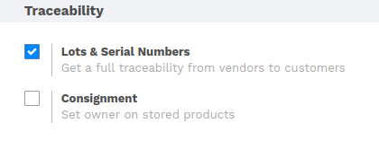
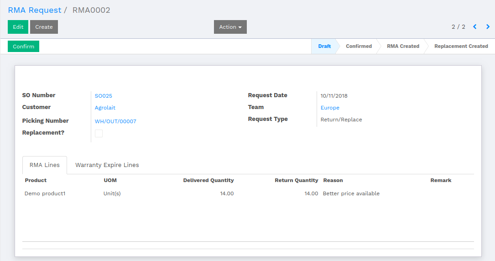
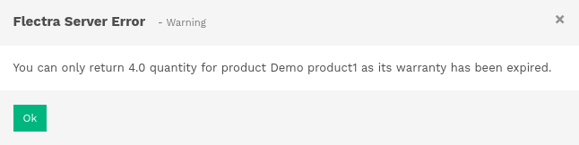
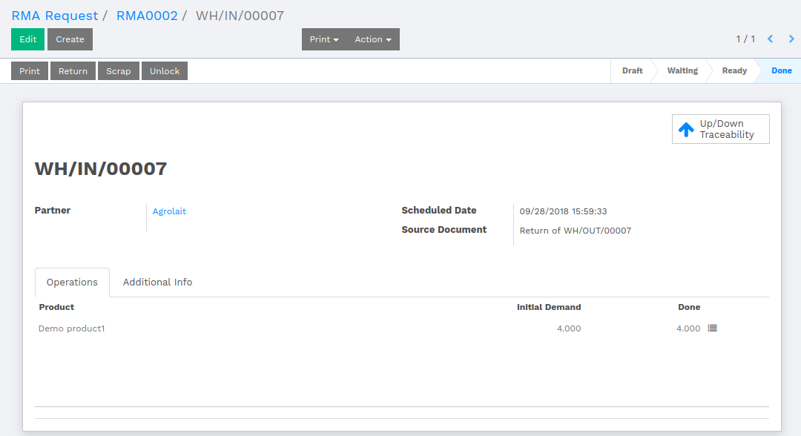
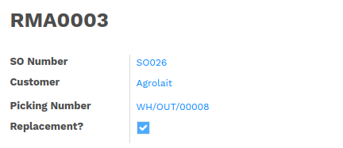
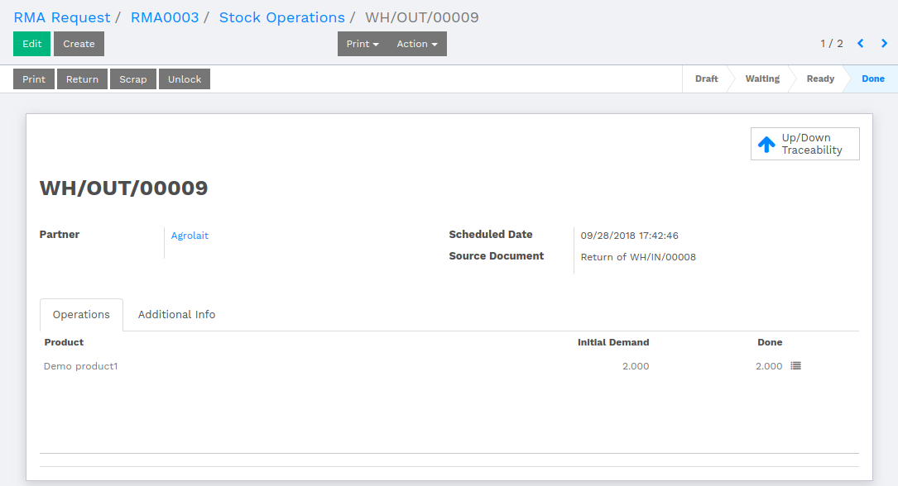
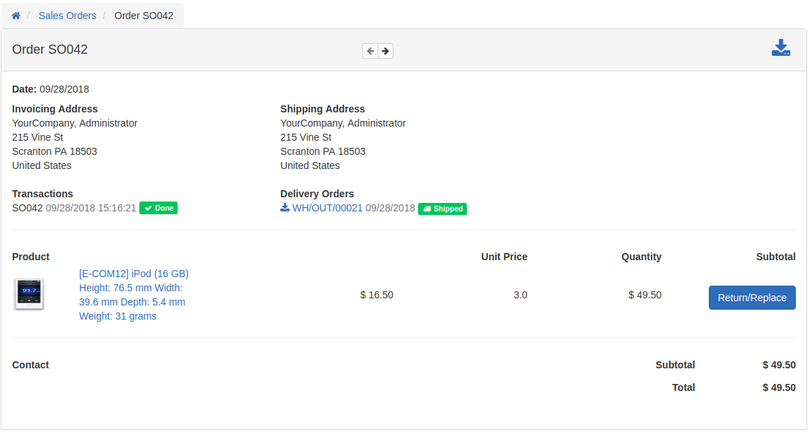
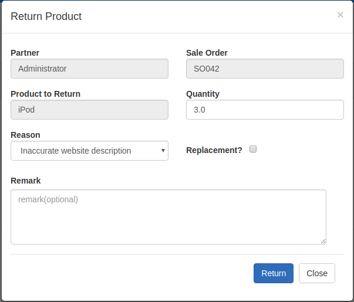
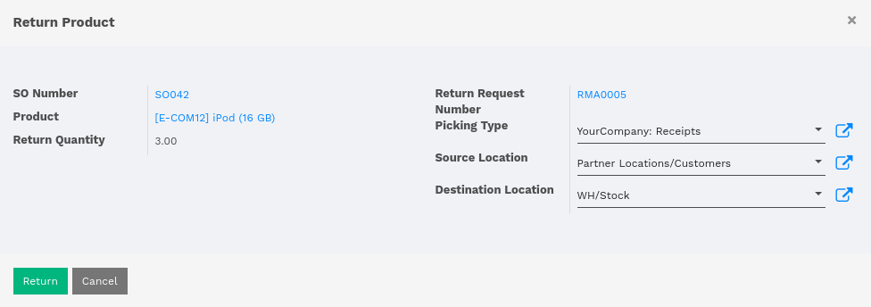

:banner: banners/flectra_rma.jpg

================================
Return Merchandise Authorization
================================

Introduction
============

A return merchandise authorization (RMA) is a part of the process of returning
a product to receive a refund, replacement during the product's
warranty period.

Configurations
==============

The user is supposed to enable the configuration of Lot & serial numbers from
:menuselection:`Inventory --> Configuration --> Settings`.

Mark the checkbox labeled as **Lot & Serial Numbers**.

.. note::
    Though the Lot & Serial Number is not enabled, the workflow will work the
    same. Only product Lot & serial will not be in the picture.

.. seealso::
    The initial flow of the RMA is common, i.e., Creating SO, confirming Sale
    order and creating delivery orders. To refer Sale Order, refer the following
    document.

    * :doc:`../../sales`

How to return the product
=========================

As mentioned above, to demonstrate the flow, there should be a completely processed SO.
To create RMA, goto :menuselection:`Sales --> RMA --> RMA Request`.

Select an SO for which the customer wants to create RMA request. Picking number which
refers to the selected SO. Select the request type.

The request date should be less than the product expiry date.

|

We have two Lot of the same product with expiry date 10/02/2018 and 10/31/2018
respectively.

If the customer is trying to return the product which is already expired, then the system
will not allow to proceed.

The warning will be generated while confirming the RMA request.

Here the expiry date of the first lot is less than the date of RMA request, that means,
some of the products are not eligible for returning. So the customer is able to return
the number of product which is mentioned in the above warning. To proceed, update the
number of quantity of product in RMA request.

Once the user clicks on **Create RMA** button, the pop up will open to ask if the user
wants refund. Once the RMA is created, product picking will be generated, where the user
has to update the quantity of the product under Operations.

Once the Stock Picking is validated, the product will be returned and the product quantity
will be increased with returned product quantity.

How to replace the product
==========================

The workflow remains the same unto creating the RMA request. The main difference is that,
there is a checkbox labeled as **Replacement?** which is mandatory to mark for replacement.

Once the RMA request is processed, the user has to Click over the **Return** button, which
will further create an **Outgoing Stock Picking**.

Once the Outgoing Stock Picking is validate, the product is Replaced successfully.

How to work with Web RMA
========================
.. seealso::
    Creating SO from the Web is already defined in Sales Document.

    * :doc:`../../sales`

Open up the Sale Order which is completely processed.

The user will be able to see a button labeled as **Return/Replace**. By clicking over that
button, a pop up will open for returning or replacing the product. The user is supposed to
key in the quantity and reason of the process. If the user wants to replace then mark the
checkbox labeled as **Replacement?**.

Now, to the backend, there will be an RMA generated related to the particular SO.
Confirm the RMA. While creating the RMA, a pop up will open where user has to select **Picking Type**.

Once the RMA is created, it will create a Stock Picking which is to be validated further
and product is returned/replaced successfully.
