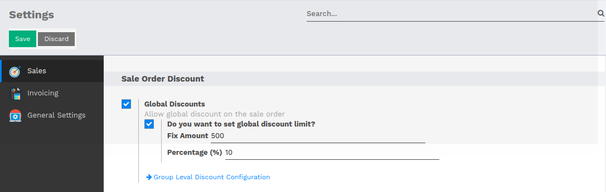
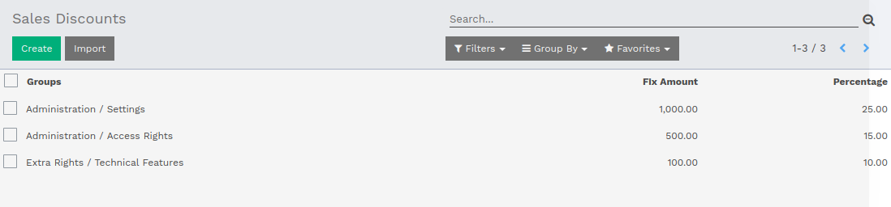
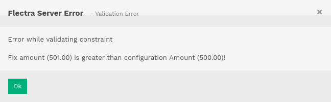
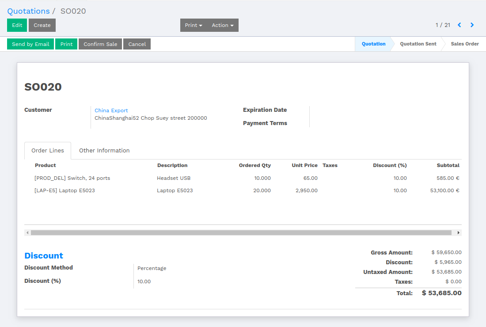
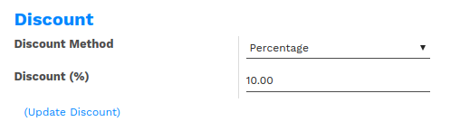
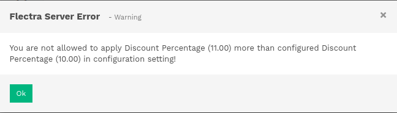
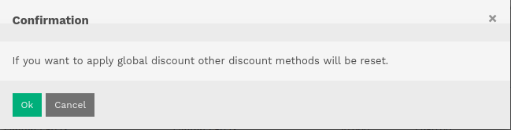
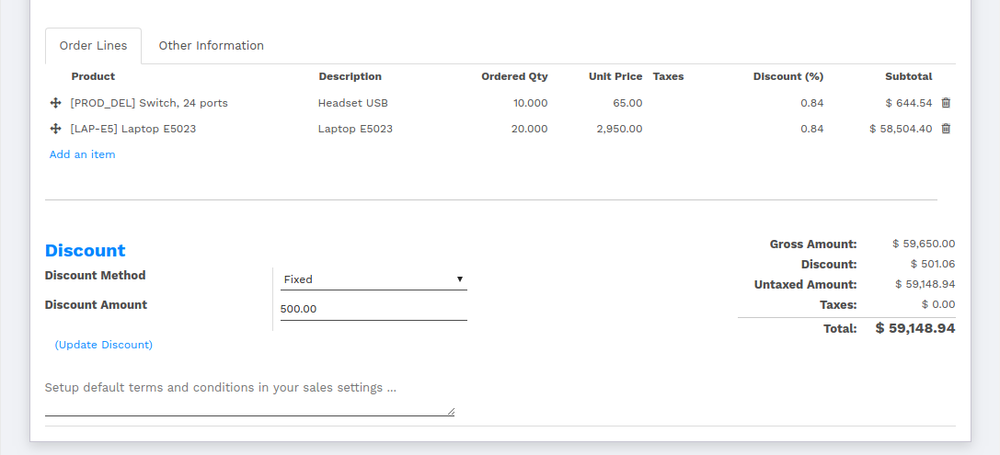

==============================
How to work with Sale Discount
==============================

Introduction
============

The document is about how the discount will be applied over Sale Order/Quotation.

It is an advance discounting system, where the user can set limit in provision of discount.

-   There are two ways of configuring Discount.

    1.  Global Discount
    2.  Ordinary Discount

Fixed discount amount and Percentage discount will be applied on Sales order lines discount.

Configurations / Settings
=========================

How to configure Global Discount
--------------------------------

To configure Global Discount, :menuselection:`goto Sales --> Configuration --> Settings`.

Once the user configures Global Discount, the discount will be applied every
where in Sale Orders/Quotations upto the configured discount amount and percentage.

If user checks the 'Global Discount', there
will be a checkbox shown with the confirmation message 'Do you want to set
global discount limit?'. Marking that checkbox, There will be two fields,
which takes user inputs and sets the discount limits in Fix Amount and Percentage.

How to configure Ordinary Discount
----------------------------------

To configure Ordinary Discount, goto :menuselection:`Sales --> Configuration --> Sales Discounts`.

.. note::
    Here, the user has to set a group and its discount limits in Fix Amount and Percentage.

Working with Discounts
======================

Sales Discounts
---------------

In Sales Discounts, the user is supposed to configure discount amount and percentage against
user groups.

The user will not be able to configure the discount amount and percentage more than
defined in the Settings, and will raise an error message.

Discounts over Sales Order/Quotation
------------------------------------

-   **Discount Percentage**

.. note::
    As the user configures Global Discount, the ordinary discount cannot be
    exceeded than Global Discount.

Discount will be applied either in percentage or in fixed amount.

If the discount method is in percentage, select the Discount method 'Percentage', and
fill in Discount(%) filed from 1 to 100. To apply the discount, there is button
below the Discount labeled as '(Update Discount)'.

.. note::
    If the discount percentage exceeds than the configured discount percentage, then
    error message will be raised.

Before applying the discount over the Sale Order/Quotation lines, the system will
ask for confirmation. It will apply the percentage in all the sales order lines
under discount column.

-   **Fixed Discount Amount**

Select the discount method 'Fixed' and fill in Discount Amount field. If user
applies the discount by clicking on '(Update Discount)', the given amount will
be divided amount all Sale Order Lines, and the percentage will be calculated
according to the amount.

The discount will be visible with gross amount of the sales order.

.. note::
    If user confirms the sale and creates the invoice for the sale order,
    discount method and discount amount or discount percentage will be set in
    invoice also.
