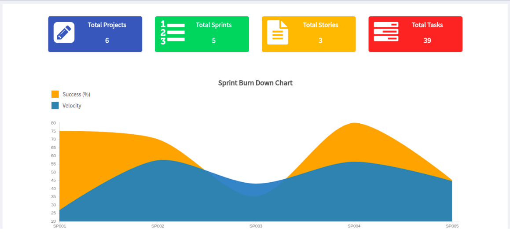
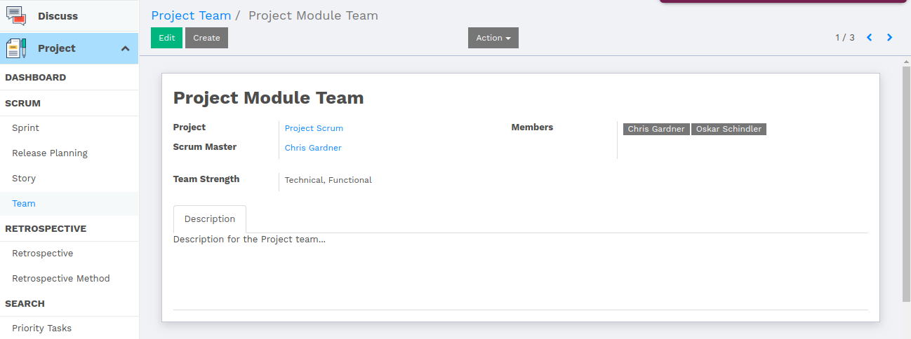
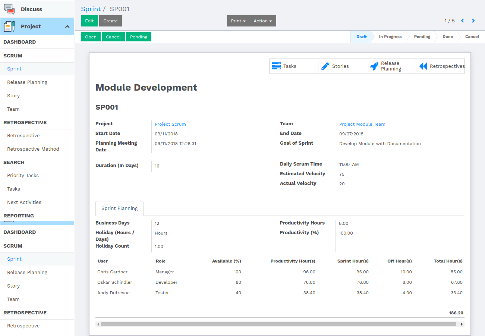
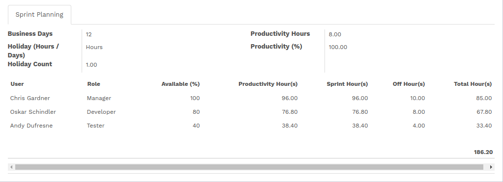
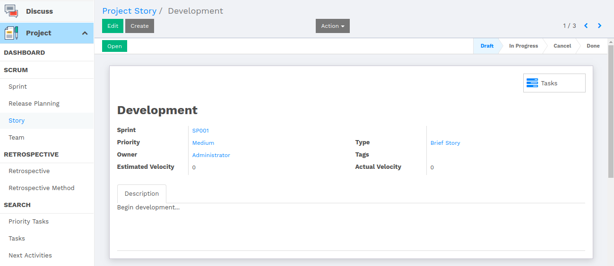
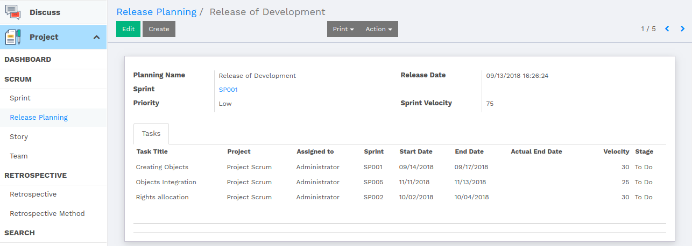
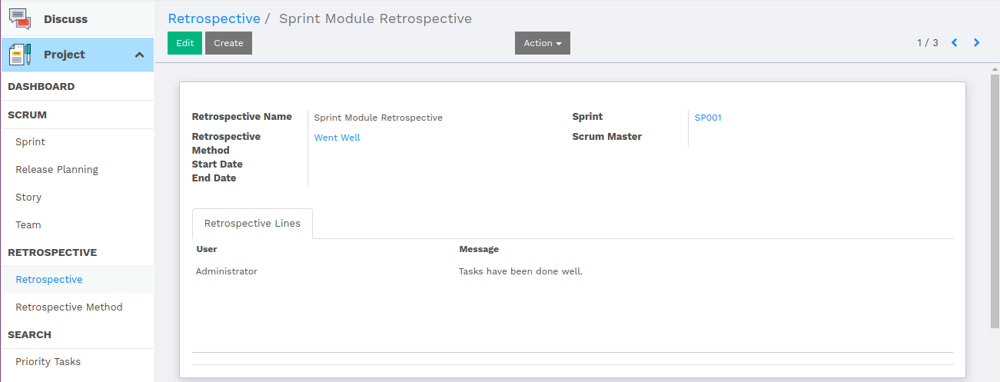

:banner: banners/flectra-project-scrum.jpg

=====
Scrum
=====

Introduction
============

What does Scrum mean?
---------------------

In Agile software development, a daily meeting in which each developer
describes what they have been doing, what they plan to do next, and any
impediments to progress.

Scrum is a management and control process that cuts through complexity
to focus on building software that meets business needs.

Scrum meeting is conducted daily for 15 minutes, where members are asked
main three questions; “What did you do since last meeting?”, “What will
you do today?” and “What impediments do you have in your way?”.

Purpose of Scrum in Agile Development
-------------------------------------

To support agile terms in collaborative and coordinating their work with
other terms.

Here in Flectra, we have introduced Scrum Management with Project Module,
where we have tried to fulfill all the functionalities of Agile Software
Development.

Sprint Dashboard
================

You will get statistical counts of Sprints, Tasks, Stories, Project for
all at once.

Dashboard gives you the idea of scrum where you can see a Burndown chart,
which shows number of sprints with its Estimated Velocity and Actual
Velocity.

Project Team
============

Project Team is a group of experts in different technologies with
different skills, who are liable for project development.

-   Attributes of the project team are as follows:

    1.  Scrum Master : A scrum master is a facilitator for an agile development team.
        The scrum master manages the process of how information is exchanged.
    2.  Members : Members are Project developers who are expert in particular field or technology.
    3.  Project : The task or responsibility, the team is allocated for.
    4.  Team Strength : Team strength describes the expertise level of the team,
        which describes team member with their skills.
    5.  Description : Description describes the overview of the project, which gives idea to the members of the project.

Sprint
======

In product development, a sprint is a set of period of time during which
specific work has to be completed and made ready for review.

Task is compartmentalized between few parts which are covered by a single sprint.

-   Sprint contains attributes which are as follows:

    1. Project - The associated project.
    2. Team - The team, working on sprint.
    3. Duration - Duration of the sprint.
    4. Daily Scrum Time - The time when scrum meeting is to be conducted.
    5. Velocity - Velocity indicates the complexity of the sprint in points.
    6. Sprint Planning - This shows the productivity hours spent by each member of the project scrum

We have put smart buttons to the top right corner of the sprint, which shows
Tasks, Stories, Release Plannings and Retrospectives according to the current sprint.

Velocity
========

Velocity is the measure of the amount of work a team can tackle during a single sprint
and is the key metric in Scrum. Velocity is calculated in the end of the sprint by
totalling the points of all fully completed tasks.

Velocity in the sprint is calculated by adding velocity of all the tasks related to the sprint.

Sprint Planning
===============

Here is a calculation of sprint planning, which shows Productivity time given to the
sprint by each member of the team.

-   Productivity Hours Calculation for team member

    -   Available Percentage - Availability of particular team member in percentage
    -   Business Days - Start date of the sprint - End date of the sprint
    -   Number of days - Number of working days of the week

        Productivity Hours = [Available Percentage * Business Days * Number of days] / 100

-   Sprint Hours Calculation for team member

    -   Available Percentage - Availability of particular team member in percentage
    -   Business Days - start date of the sprint - end date of the sprint
    -   Productivity Hours = Working hours / Total Hours

        Sprint Hours = [Available Percentage * Business Days * Productivity Hours] / 100

-   Total Hours Calculation for team member

    [Total Hours = Sprint hours - Holiday count(In Hours) - Off hours]

Project Story
=============

Project Stories are one of the primary development artifact for scrum project team.
A user story is a very high-level definition of a requirement, containing just enough
information so that the developers can produce a reasonable estimate of the effort to
implement it.

A story may contain multiple tasks, there may have a single story containing all
the user requirements for Project tasks.

-   Attributes of Project Story are as follow:

    -   Sprint : The sprint which is associated to the project
    -   Priority : Priority of the story
    -   Owner : Owner of the story (Who wrote the story)
    -   Estimated Velocity/Actual Velocity : Velocity of the story
    -   Description : Description of the story

Velocity of the story is calculated by totalling the velocity of each task related
to the current story.

Release Planning
================

A very high-level plan for multiple Sprints is created during the Release Planning.
It is a guideline that reflects the expectations about which feature will be
implemented and when they are completed. It also serves as a base to monitor
progress within the project. Release can be intermediate deliveries done during
the project or the final delivery at the end.

One sprint can have multiple release plannings according to the task divided
into several subtasks. Whichever subtask is completed first, will be treated
for releasing.

-   Attributes of Release Planning are as follows

    1.  Sprint - Sprint associated to the release planning.
    2.  Priority - How important the current release planning is, that is shown by priority.
    3.  Release Date - Date of Releasing.
    4.  Tasks - Number of tasks, which shows that how many of them are going to be released under the plan.

Retrospective
=============

Retrospective is meeting that helds at the end of an iteration of development
life cycle. During the retrospective, the team reflects on what happened in the
and identifies actions for improvement	going forward.

The sprint retrospective is meeting facilitated by the Scrum Master at which
the team discusses sprint and determines what could be changed that might make
the next sprint more productive. The sprint review looks at what the team is
building, whereas the retrospective looks at how they are building it.

-   Attributes of Retrospective are as follow

    1.  Sprint - The sprint which is going through the retrospective.
    2.  Retrospective Method - Method, that is used for the retrospective process.
    3.  Scrum Master - The one who held the process.
    4.  Retrospective Lines - It has two fields, User and Message, where the current
        logged in user gives the review on the Sprint as per the process.