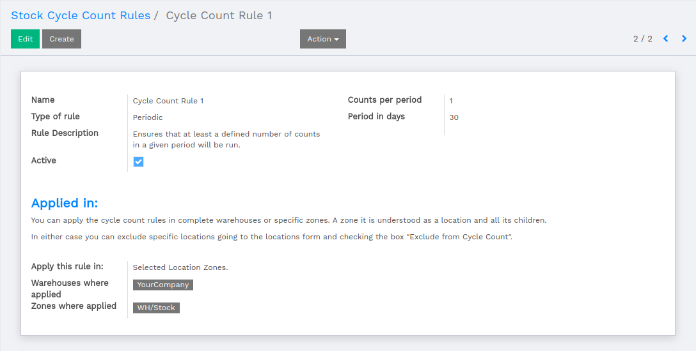
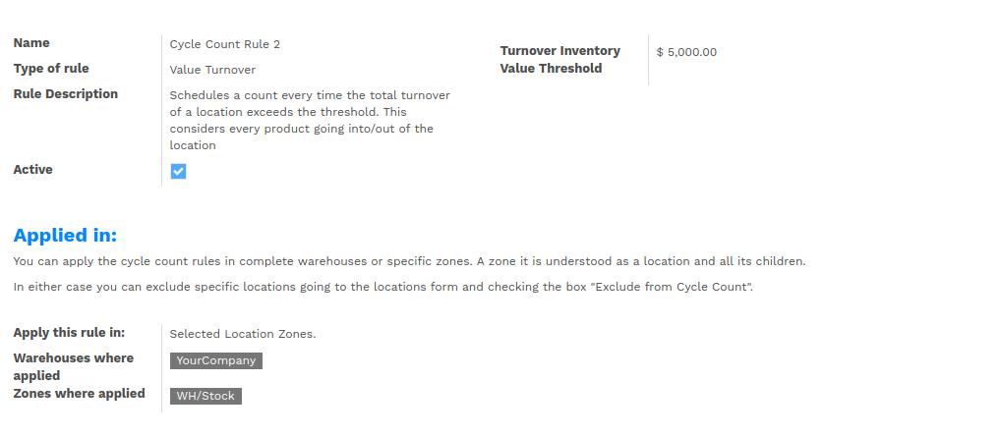
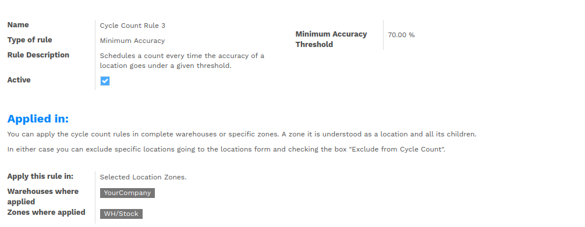
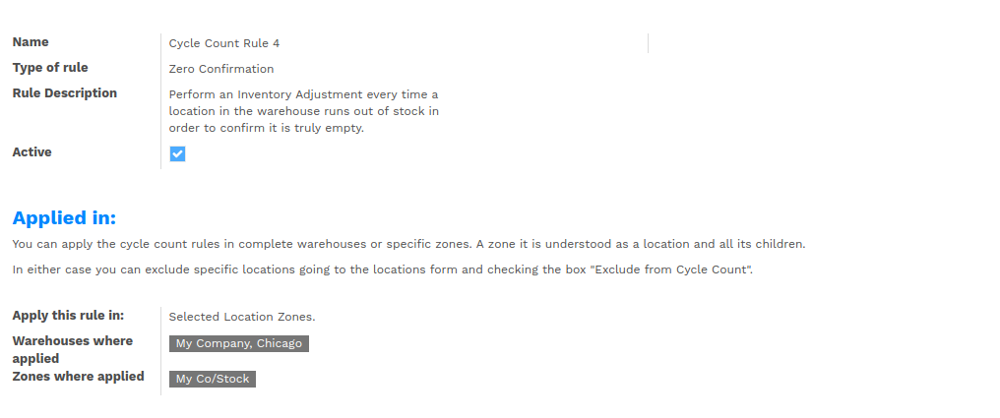
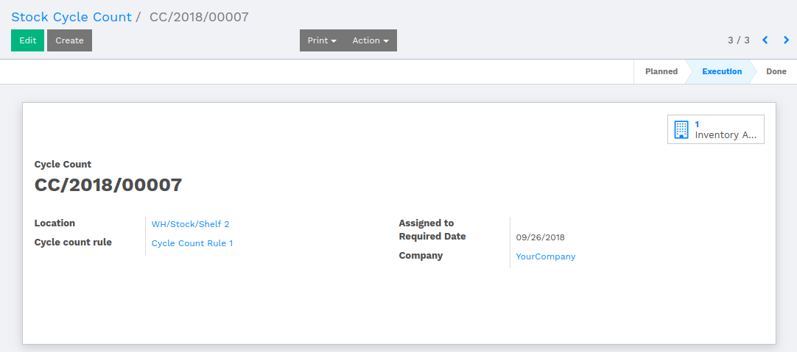
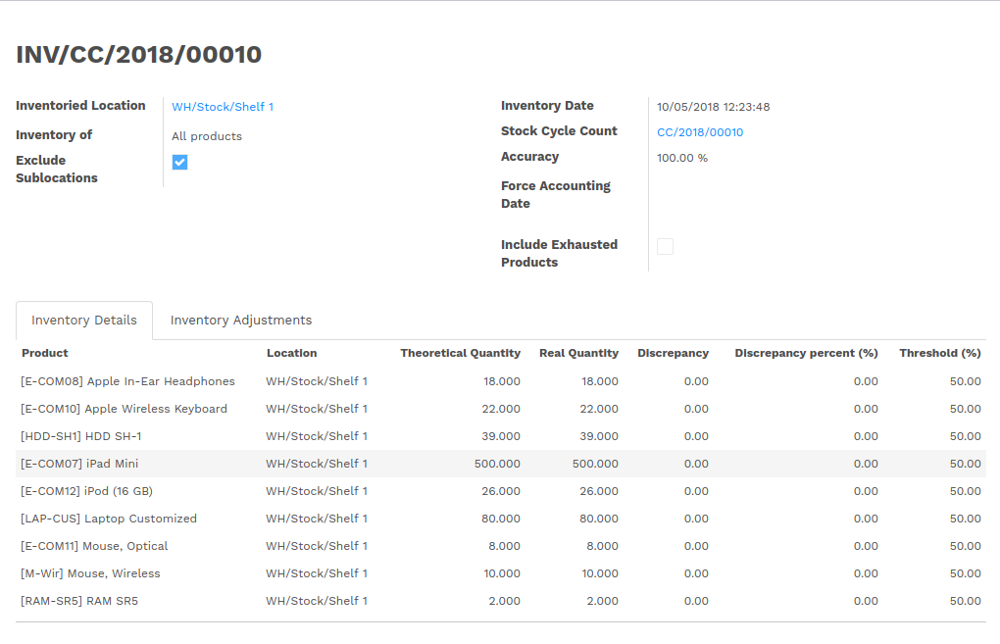

:banner: banners/flectra-stock-cycle-count.jpg

=================
Stock Cycle Count
=================

Introduction
============

Stock cycle count is an inventory auditing procedure, which falls under inventory management,
where a small subset of inventory, in a specific location, is counted on a specified day.

Configurations
==============

To deal with stock cycle count, the user has to do such configurations.

Make sure that checkboxes labeled as 'Validate Inventory Adjustment Under Threshold'
and 'Validate All Inventory Adjustments' is marked under :menuselection:`Settings --> Users --> Administrator`.

The user has to make checkbox labeled as 'Manage Multiple Stock Locations' under
:menuselection:`Settings --> Users --> Administrator`.

Stock Cycle Count Rules
=======================

The user is supposed to create a cycle count rule, so that the system can
look into the inventory to count the stock with specific warehouse and its child locations.

*   There are following types of Cycle Count Rule.

    *   Periodic
    *   Value Turnover
    *   Minimum Accuracy
    *   Zero Confirmation

.. note::
    User can apply cycle count rule either on warehouse or on warehouse location zones.
    If the rule is applied only on warehouse, then the system will consider all products
    under that warehouse.

    If the rule is applied over warehouse and its particular location, then the system will consider
    only those products which falls under that warehouse location.

Periodic
--------

The user has to set number of days in **period in Days** field,
which indicates that the cycle will execute in these period of days.

The system will generate an execution date for inventory adjustment by using **Counts per Period** and
**Period in Days**.

The scheduler will create **Cycle Counts** based on calculation of cycle count rule and its period.

Value Turnover
--------------

While working with Value Turnover, the user is supposed to set turnover amount under
**Turnover Inventory Value Threshold** and set warehouse location. When the scheduler executes,
it will calculate the turnover of that particular location.

If the turnover of that location is less than the turnover defined in Cycle Count Rule, than number
of stock cycle count will be generated based on Value Turnover Stock Cycle Count.

Minimum Accuracy
----------------

While working with Minimum Accuracy, the user is supposed to set percentage under **Minimum Accuracy Threshold**
and set warehouse location. When the scheduler executes, it will calculate the accuracy of warehouse location based
on products and its available quantity.

If the calculated accuracy is less than the minimum accuracy defined in Cycle Count Rule, than the number of stock
cycle count will be generated.

Zero Confirmation
-----------------

While working with Zero Confirmation, the system will perform an Inventory Adjustment every time the location
in the warehouse runs out of stock in order to confirm it is truly empty.

If the selected warehouse location has zero quantity of products, then the system will create a Stock Cycle
Count for this particular warehouse location.

Stock Cycle Counts
==================

There is a scheduler which executes once on daily bases. It creates **Stock Cycle Count** according
to the Cycle Count Rule.

The system will consider the warehouse, it location and sub-location to create **Stock Cycle Count**.
Each Stock Cycle Count refers to a particular warehouse location for which it will plan the inventory.

Once the Stock Cycle Count is confirmed, the system will create number of inventories associated to
that particular Cycle Count which will be available from smart button labeled as **Inventory Adjustment**.

Inventory Adjustment
--------------------

The inventory associated to the Stock Cycle Count has to be started for inventory adjustment. Once the
inventory adjustment is started, it will calculate the **Accuracy** of the inventory based on **Inventory Details**
lines.

*   Inventory Details

    -   There are number of products with its number of quantity and its discrepancy calculation.
    -   There are two quantities, **Theoretical Quantity** and **Real Quantity**, which are the parameters to
        calculate the Discrepancy of the product and Accuracy of the Inventory.
    -   The Discrepancy show that the number of quantity of product is lacking than the desired quantity.
        The Discrepancy is calculated by following formula.

        **Discrepancy = Real Quantity - Theoretical Quantity**

    -   Discrepancy Percent is the Discrepancy calculated in percentage.
    -   The Threshold is the level of quantity of product warehouse location, which is to be defined in the
        location associated to the product.

.. note::
    -   Inventory adjustment will be made by comparing the theoretical and the checked quantities.
    -   The user can delete lines to ignore some products.
    -   If product is not at the right place, set the checked quantity to 0 and create a new
        line with correct location.