:banner: banners/sale_advance_pricelist.jpg

==============================
Website Sale Advance Pricelist
==============================

Overview
========

Website Sale Advance Pricelist module is developed to give an advance discount. In this module, we have to give functionality to Add Price Rules, Cart Rules, Coupon Rules and Discount Calculation Details Widget.

Configuration
=============

Install the Website Sale Advance Pricelist
------------------------------------------

You’ll need to install the Website Sale Advance Pricelist module from the app module in the Flectra backend.
Go into the ``Apps`` and search ``Website Sale Advance Pricelist``.

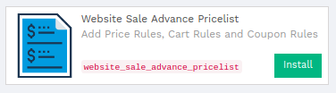

View Pricelists menu and Pricelist Items
----------------------------------------

To enable the feature, go into the ``Settings`` ‣ ``USERS & COMPANIES`` ‣ ``Users``, select Users, tick ``Manage Pricelist Items`` and ``Sales Pricelists`` and Save records.

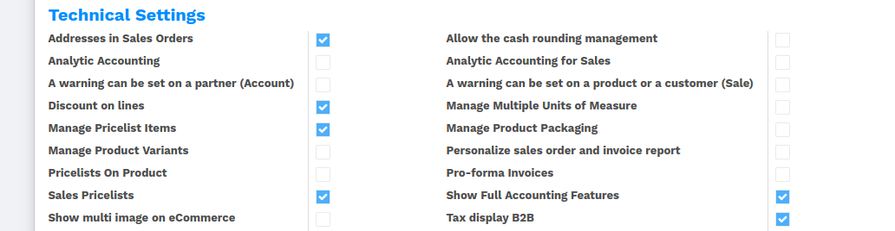

Pricelists Configuration
------------------------

Go into the ``Website`` ‣ ``CATALOG`` ‣ ``Pricelists`` select pricelist.

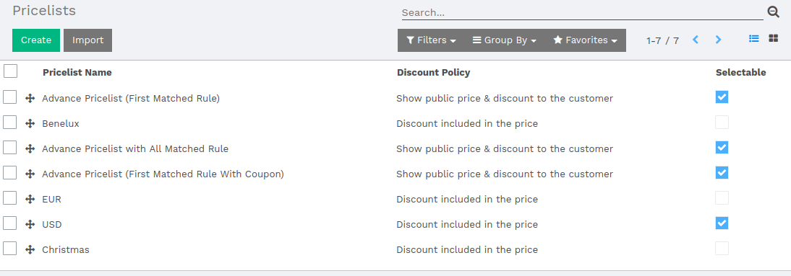

Pricelist Type
~~~~~~~~~~~~~~

We have introduced new fields like ``Pricelist Type``.

- ``Basic``: If you want to work with the default flow, then you can select Basic. Default it is Basic.
- ``Advance``: If you want to use advanced features like Price Rule, Cart Rules, and Coupon Codes then you can select Advanced.

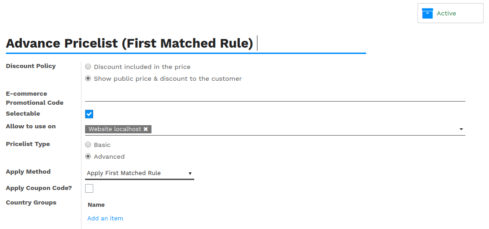

Apply Method
~~~~~~~~~~~~

We have introduced new fields like ``Apply Method``.

- ``Apply First Matched Rules``: Calculate discount of the first match conditions of Price Rules and Cart Rules.
- ``Apply All Matched Rules``: Calculate discount of the all match conditions of Price Rules and Cart Rules.
- ``Apply Smallest Matched Discount``: Append minimum discount of every match condition of Price Rules and Cart Rules and get minimum values from the list of the Price Rules and Cart Rules.
- ``Apply Biggest Matched Discount``: Append maximum discount of every match condition of Price Rules and Cart Rules and get maximum values from the list of Price Rules and Cart Rules.

Apply Coupon Code?
~~~~~~~~~~~~~~~~~~

We have introduced new fields like ``Apply Coupon Code?``.

- Select apply coupon code option in pricelist for applying the coupon code.

.. _website_price_rule:

Price Rules
===========

If you selected ``Pricelist Type as Advanced`` then you can view price rules' line in the pricelist. You can configuration price rules as per your requirements.

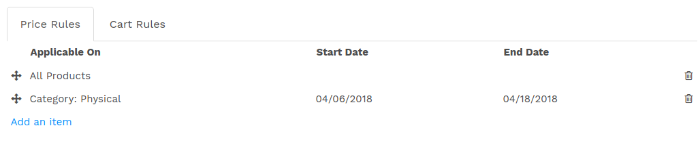

If you want to add ``Price Rules`` then click on Add an item. Once you click on Add an item you can see this window.

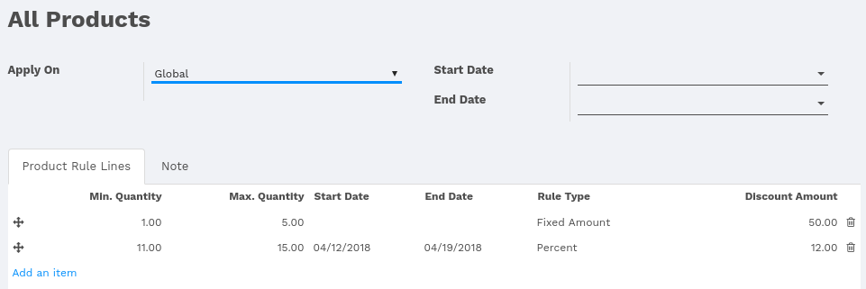

.. _website_apply_on:

Apply On
--------

- ``Global``: Apply for all Product.
- ``Category``: Apply only for the selected category.If you select Apply on as Category then new field Category will be visible.

- ``Product Template``: Apply only for selected Product Template variants.If you select Apply on as Product Template then new field Product Template will be visible.

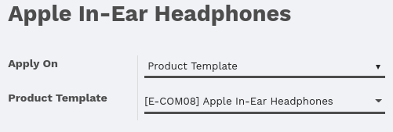

- ``Product Variant``: Apply only for selected Product variants.If you select Apply on as Product variants, then new field Product will be visible.

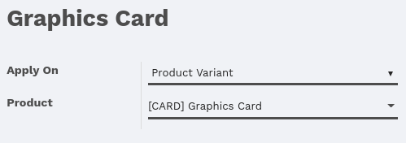

If you want to add ``Price Rules Lines`` then click on Add an item. Once you click on Add an item you can see this window.

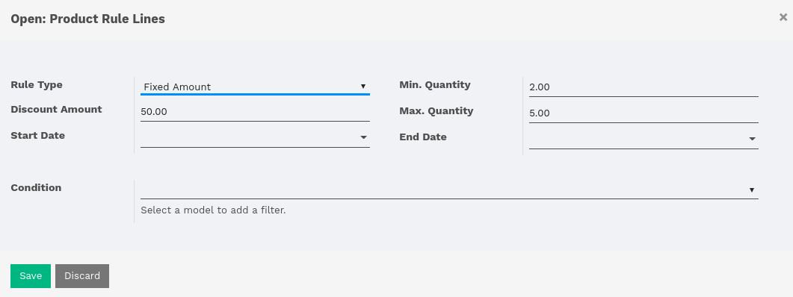

Rule Type
---------

- ``Fixed Amount``: If you want to give discounts in fixed amount then you can select the rule type as Fixed Amount.
   .. note::
       Fixed Amount converts into Percentage as per Unit Price of product in sale order line.  
       E.g. Product Unit Price is 885 and Discount Amount is 50 then 50 * 100 / 885 = 5.65

- ``Percent``: If you want to give discounts in percentage then you can select the rule type as Percent.

Other Fields
------------

- ``Discount Amount``: Define the amount of discount.

- ``Min Quantity``: Rule to apply if quantity must be greater than or equal to the min quantity specified in this field.

- ``Max Quantity``: Rule to apply if quantity must be less than or equal to the max quantity specified in this field.

- ``Start Date``: Rule to apply if start date must be greater than or equal to the start date specified in this field.

- ``End Date``: Rule to apply if end date must be less than or equal to the end date specified in this field.

- ``Condition``: If present, this condition must be satisfied before executing the action rule.

Cart Rules
===========

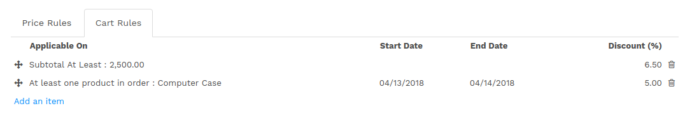

Cart Rules are applicable on sale order if the condition is matched which defined in cart rules items.

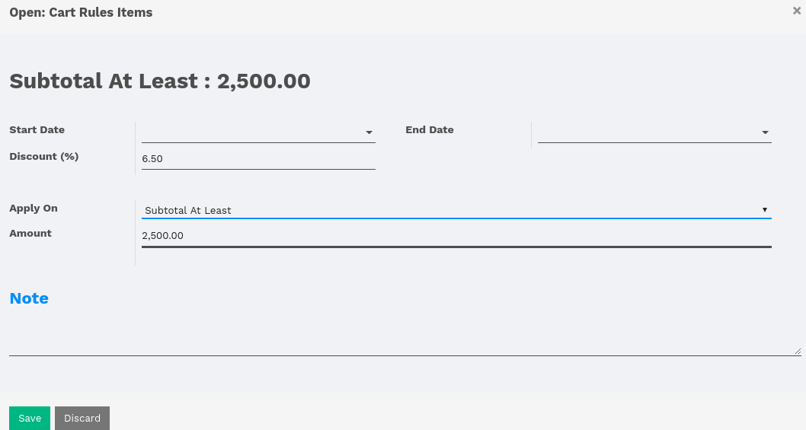

Apply On
--------
- ``Subtotal At Least``: Cart Rules do not apply if Untaxed Amount is less than define amount in cart line.
- ``Subtotal less than``: Cart Rules apply if Untaxed Amount is less than define amount in cart line.
- ``Lines Count at least``: Cart Rules do not apply if line count of sale order(duplicate product exclude) is less than define amount in cart line.
- ``Lines less than``: Cart Rules apply if line count of sale order(duplicate product exclude) is less than define amount in cart line.
- ``Sum of Item Qty at least``: Cart Rules do not apply if the total quantity of product in sale order is less than define amount in cart line.
- ``Sum of Item Qty less than``: Cart Rules apply if the total quantity of product in sale order is less than define amount in cart line.
- ``At least one product in order``: Cart Rules apply if product match in sale order which defines in cart line. If you select Apply on as ``At least one product in order`` then new field ``Product`` will be visible.

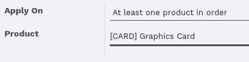

- ``None of selected Products``: Cart Rules do not apply if product match in sale order which defines in cart line. If you select Apply on as ``None of selected Products`` then new field ``Products`` will be visible.

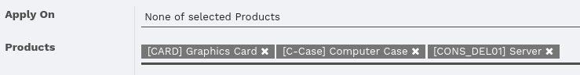

- ``At least one category in order``: Cart Rules apply if product category match in sale order which defines in cart line. If you select Apply on as ``At least one category in order`` then new field ``Category`` will be visible.

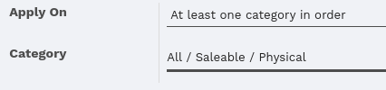

- ``None of selected Categories``: Cart Rules do not apply if product category match in sale order which defines in cart line. If you select Apply on as ``None of selected Categorie`` then new field ``Categories`` will be visible.

Coupon Rules
============

Coupon Rules discounts for sale such as a fixed discount, a percentage etc... of the entire sale order. 

Apply Coupon Code
-----------------
Select ``Apply Coupon Code?`` option in pricelist for applying the coupon code.

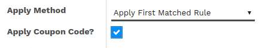

Once you have selected Apply Coupon Code? An option you will display Coupon Code line in pricelist.

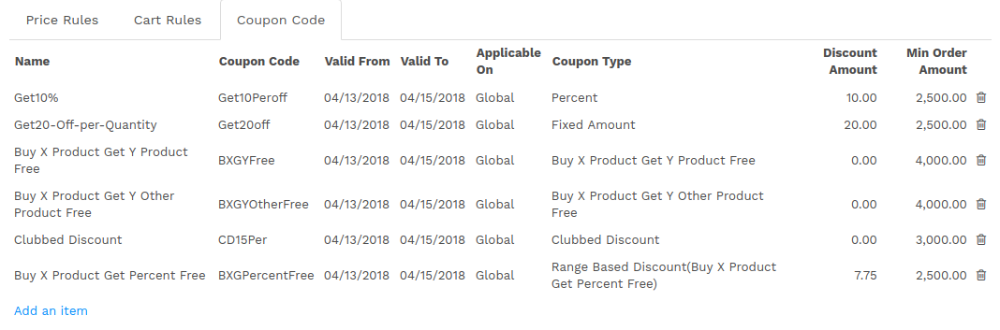

Coupon Type Basic Conditions
----------------------------
Coupon code rule to apply, if all conditions match which define below.

 - ``Total Usage Limit``: You can allow using maximum coupon limit.
 - ``Remaining Usage Limit``: The limit is reduced when sale order will be confirmed. If the limit is zero then this coupon code not used.
 - ``Valid From``:- If Valid From must be greater than or equal to the Valid From specified in this field.
 - ``Valid To``: If Valid To must be less than or equal to the Valid To specify in this field.
 - ``Min Order Amount``: If Untaxed Amount of Sale order must be greater than or equal to the Min Order Amount.
 - ``Apply On``: It is same as Price Rule(See :ref:`website_apply_on`).
 - ``Condition``: If present, this condition must be satisfied before executing the action rule.

.. _website_coupon_type:

Coupon Type
-----------

There are many Coupon Type which is listed below.

.. _website_coupon_percent:

Percent
~~~~~~~

- Add a percentage in the discount of every order line in which you apply the coupon code.

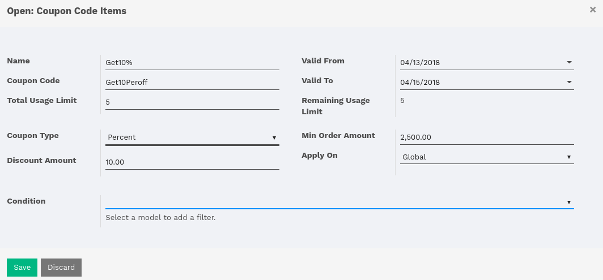

.. _website_coupon_fixed_amount:

Fixed Amount
~~~~~~~~~~~~

- If you want to give discounts on fixed amount then you can select Coupon Type as Fixed Amount.
   .. note::
       If the fixed amount is greater than or equal to the Unit Price of product in sale order line, then it gives 100% discount.Fixed Amount convert into Percentage as per Unit Price of product in sale order line. E.g. Product Unit Price is 885 and Discount Amount is 50 then 50 * 100 / 885 = 5.65

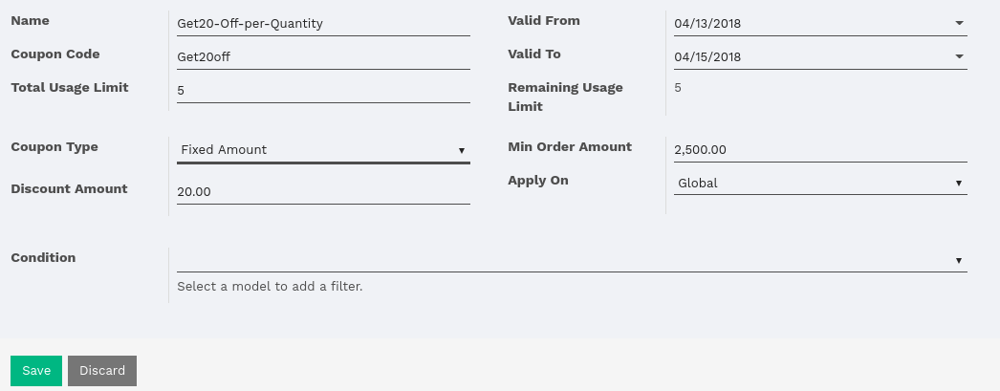

.. _website_coupon_buy_x_get_y:

Buy X Product Get Y Product Free
~~~~~~~~~~~~~~~~~~~~~~~~~~~~~~~~

- It applies in order line where product quantity is greater than or equal to ``Number Of X Product`` in the coupon. Get ``Y same product`` unit free when buying X product.

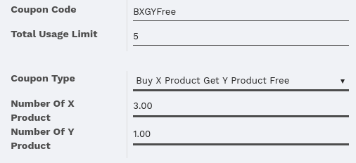

.. _website_coupon_buy_x_get_y_other:

Buy X Product Get Y Other Product Free
~~~~~~~~~~~~~~~~~~~~~~~~~~~~~~~~~~~~~~

- It applies in order line where product quantity is greater than or equal to ``Number Of X Product`` in the coupon. Get ``Number Of Y Product`` Other Product(``[C-Case] Computer Case``) when buying X product.

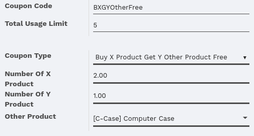

.. _website_coupon_range_based:

Range Based Discount(Buy X Product Get Percent Free)
~~~~~~~~~~~~~~~~~~~~~~~~~~~~~~~~~~~~~~~~~~~~~~~~~~~~

- It applies in order line where product quantity is greater than or equal to ``Number Of X Product`` in the coupon code and get percent free(``7.75``) when buying X product.

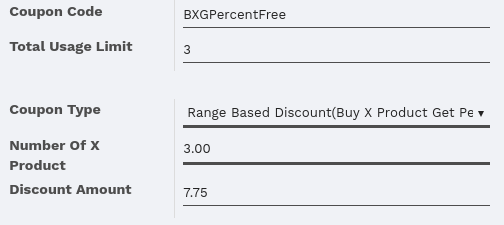

.. _website_coupon_clubbed:

Clubbed Discount
~~~~~~~~~~~~~~~~

- Add a Discount and Extra Discount on Sale order line.

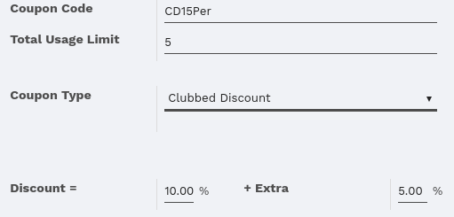

You can view sale order in the particular coupon code. Go into ``Pricelist`` ‣ ``Coupon Code``‣  open Coupon Code. 

Website Sale Orders
===================

We have to give functionality to add price rules discount, cart rules discount, coupon rules discount and view discount calculation details widget.

.. image:: images/shop_page.png
    :class: img-responsive

.. note::
    Pricelist (See :ref:`website_price_rule`) of current user.
    Default 1 quantity in shop page so, it gives 50 fixed amount for every product. If the product price is less than 50 then it becomes 0.
    The discount is automatically changed when order quantity updates.

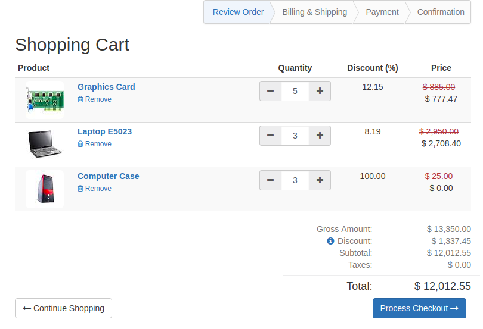

Here we have define ``Discount`` field visibilty in order lines and also add ``Gross Amount`` and ``Discount`` of sale order.

First order line discount calculation
-------------------------------------

- ``Product Rule Line``:

First order line quantity 5 is between 1 to 5 in Product Rule Line(See :ref:`website_price_rule`).
Here define **Discount Amount = 50** and **Rule Type = Fixed Amount** so we need to convert into a percentage.

.. tip::
    :class: aphorism

    - Percentage Calculation Formule = Discount Amount * 100 / Unit Price of Product
    - 50 * 100 / 885 = 5.65

- ``Cart Rules``:-

6.5 % of Match first Cart Rules because **Subtotal(Untaxed Amount=12,012.55)** At least: 2,500.00.

- Discount = Product Rule line(**5.65**) + Cart Rules(**6.5**)

``So, discount is 5.65 + 6.5 = 12.15%``

Second order line discount calculation
--------------------------------------

Second order line quantity 3 is between 1 to 5 in Product Rule Line(See :ref:`website_price_rule`).
Here define **Discount Amount = 50** and **Rule Type = Fixed Amount** so we need to convert into a percentage.

.. tip::
    :class: aphorism

    - Percentage Calculation Formule = Discount Amount * 100 / Unit Price of Product
    - 50 * 100 / 2950 = 1.69

- ``Cart Rules``:-

6.5 % of Match first Cart Rules because **Subtotal(Untaxed Amount=12,012.55)** At least: 2,500.00.

- Discount = Product Rule line(**1.69**) + Cart Rules(**6.5**)

``So, discount is 1.69 + 6.5 = 8.19%``

Third order line discount calculation
-------------------------------------

Third order line quantity 3 is between 1 to 5 in Product Rule Line(See :ref:`website_price_rule`).

Unit Price(25) is less than Fixed Amount(50) of Product Rule Lines.

``So, it gives 100% discount for that line``

Discount Calculation Informations
---------------------------------

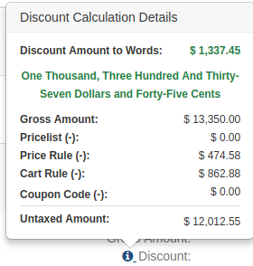

Once you click on information icon button, you can view discount calculation details. Here display total Price Rule, Cart Rules, and Coupon Code discount etc..

After that, it's default flow of website_sale.

Website Sale Orders With Coupon Code
====================================

Coupon code price rule lines and cart rules:

.. _website_price_rule_line:

Price Rule Lines
----------------

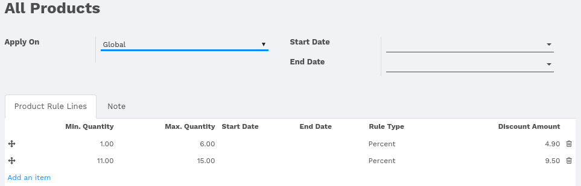

.. _website_cart_rule_line:

Cart Rules
----------

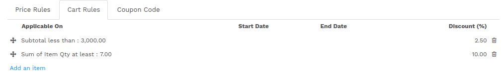

We have already configured Coupon code(See :ref:`website_coupon_type`).

Promo Code
----------

If you want to apply Promo Code go to ``Website`` ‣ ``Dashboard`` ‣  ``Go To Website`` ‣  ``Click on Shop menu`` ‣  ``Select any product`` ‣  ``Click on Add To Cart`` ‣  ``Click on Customize Menu`` ‣  ``Select Promo Code True``. After that, you can visible Promo Code field. 

If current user have pricelist ``Advance Pricelist (First Matched Rule With Coupon)``.

Coupon Code Warning 
-------------------

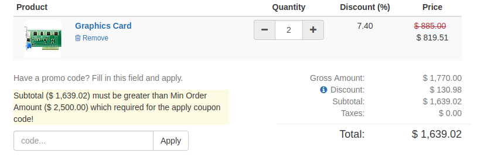

We have entered coupon code ``Get10Peroff`` and click on ``Apply`` button it will give the warning message if subtotal is less than min order amount in the coupon code. Here in the coupon code Min Order Amount set $2500.00 and Subtotal is $1639.02 (See :ref:`website_coupon_percent`).

Website Sale Orders With Percentage Coupon Code
-----------------------------------------------

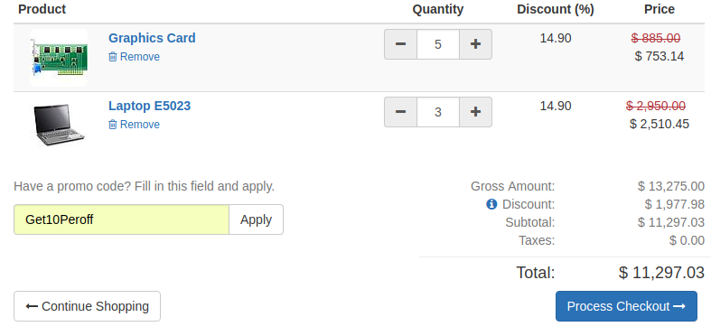

We have entered coupon code ``Get10Peroff`` and click on ``Apply`` button. After the click on ``Apply`` discount value changed in sale order line.

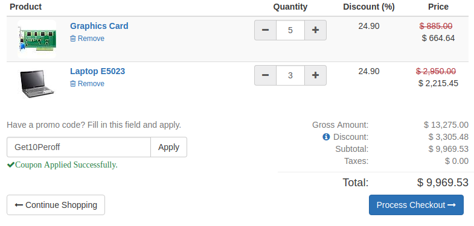

First order line discount calculation
~~~~~~~~~~~~~~~~~~~~~~~~~~~~~~~~~~~~~

- ``Product Lines Rules``

4.9 % of Match first Product Rule Lines (See :ref:`website_price_rule_line`) because ordered Qty 5 is between 1 to 6.

- ``Cart Rules``

First cart Rules (See :ref:`website_cart_rule_line`) don't match because Subtotal is greater than 3,000.00 so that rules skip.

Second Cart Rules (See :ref:`website_cart_rule_line`) match because of Sum of Item Qty at least: 7.00 (here 8). So add 10 %.

.. note::
    Quantity : First order line quantity (5) + Second order line quantity (3)

- ``Coupon Code`` : Coupon code (See :ref:`website_coupon_percent`) get 10 percent free.

- Discount = Product Rule line(**4.9**) + Cart Rules(**10**) + Coupon Code(**10**)

``So, First line discount is 24.9 %( 4.9 + 10 + 10)``

.. note::
    Same calculation for the second line of sale order.

.. note::
    If you want to remove coupon code then click on Apply again.

Website Sale Orders With Fixed Amount Coupon Code
-------------------------------------------------

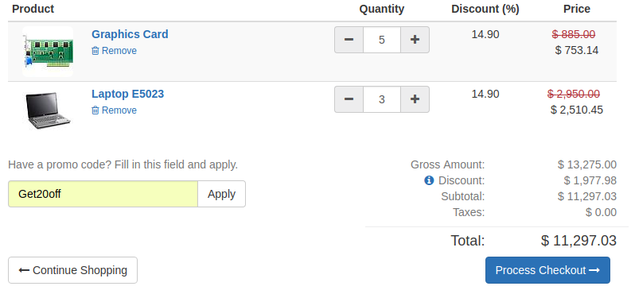

We have entered coupon code ``Get20off`` and click on ``Apply`` button. After the click on ``Apply`` discount value changed in sale order line.

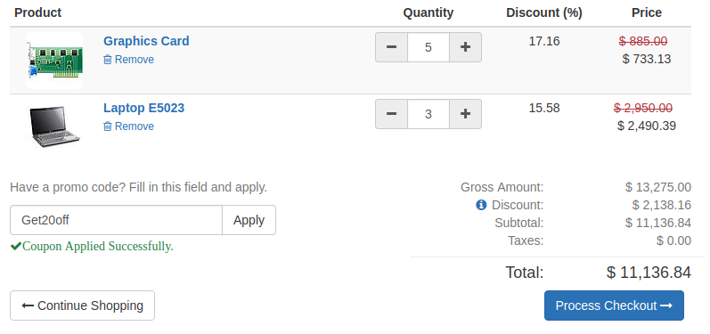

First order line discount calculation
~~~~~~~~~~~~~~~~~~~~~~~~~~~~~~~~~~~~~

- ``Product Lines Rules``

4.9 % of match first Product Rule Lines (See :ref:`website_price_rule_line`) because ordered Qty 5 is between 1 to 6.

- ``Cart Rules``

First Cart Rules (See :ref:`website_cart_rule_line`) don't match because Subtotal is greater than 3,000.00 so that rules skip.

Second Cart Rules (See :ref:`website_cart_rule_line`) match because of Sum of Item Qty at least: 7.00 (here 8). so add 10 %.

.. note::
    Quantity : First order line quantity (5) + Second order line quantity (3)

- ``Coupon Code`` : Coupon code (See :ref:`website_coupon_fixed_amount`) get fixed amount 20 per product.

Here define **Discount Amount = 20** so we need to convert into the percentage.

.. tip::
    :class: aphorism

    - Percentage Calculation Formule = Discount Amount * 100 / Unit Price of Product
    - 20 * 100 / 885 = 2.26

- Discount = Product Rule line(**4.9**) + Cart Rules(**10**) + Coupon Code(**2.26**)

``So, First line discount is 17.6 %( 4.9 + 10 + 2.26)``

Second order line discount calculation
~~~~~~~~~~~~~~~~~~~~~~~~~~~~~~~~~~~~~~

- ``Product Lines Rules``

4.9 % of match first Product Rule Lines (See :ref:`website_price_rule_line`) because ordered Qty 5 is between 1 to 6.

- ``Cart Rules``

First Cart Rules (See :ref:`website_cart_rule_line`) don't match because Subtotal is greater than 3,000.00 so that rules skip.

Second Cart Rules (See :ref:`website_cart_rule_line`) match because of Sum of Item Qty at least: 7.00 (here 8). so add 10 %.

.. note::
    Quantity : First order line quantity (5) + Second order line quantity (3)

- ``Coupon Code`` : Coupon code (See :ref:`website_coupon_fixed_amount`) get fixed amount 20 per product.

Here define **Discount Amount = 20** so we need to convert into the percentage.

.. tip::
    :class: aphorism

    - Percentage Calculation Formule = Discount Amount * 100 / Unit Price of Product
    - 20 * 100 / 2950 = 0.68

- Discount = Product Rule line(**4.9**) + Cart Rules(**10**) + Coupon Code(**0.68**)

``So, First line discount is 15.58 %( 4.9 + 10 + 0.68)``

Website Sale Orders With Buy X Product Get Y Product Free Coupon Code
---------------------------------------------------------------------

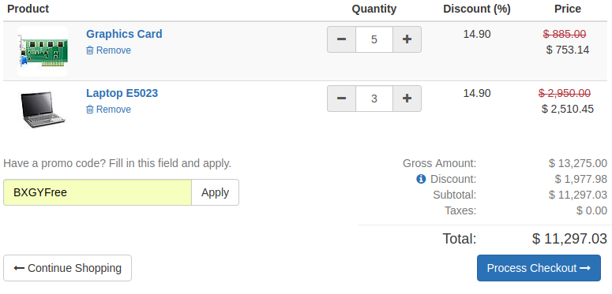

We have entered coupon code ``BXGYFree`` and click on ``Apply`` button. After the click on ``Apply`` 2 more line created in sale order line.

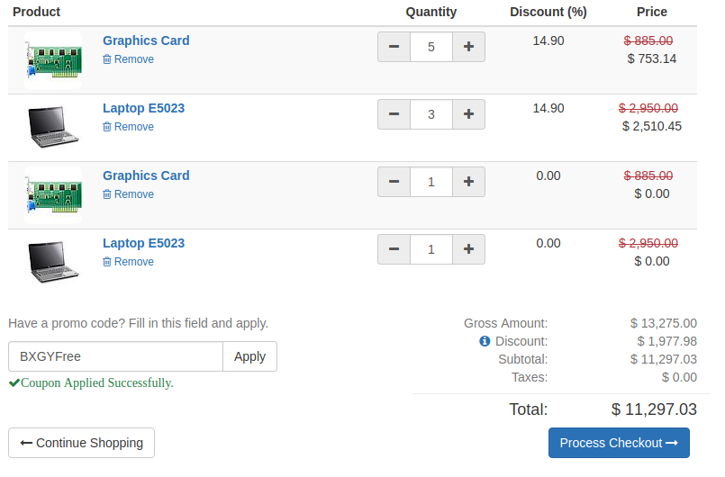

First order line discount calculation
~~~~~~~~~~~~~~~~~~~~~~~~~~~~~~~~~~~~~

- ``Product Lines Rules``

4.9 % of Match first Product Rule Lines (See :ref:`website_price_rule_line`) because ordered Qty 5 is between 1 to 6.

- ``Cart Rules``

First cart Rules (See :ref:`website_cart_rule_line`) don't match because Subtotal is greater than 3,000.00 so that rules skip.

Second Cart Rules (See :ref:`website_cart_rule_line`) match because of Sum of Item Qty at least: 7.00 (here 8). so add 10 %.

.. note::
    Quantity : First order line quantity (5) + Second order line quantity (3)

- ``Coupon Code`` : Coupon code (See :ref:`website_coupon_buy_x_get_y`) get y number of product free.

In this coupon code we get 1 same product free of buy every 3 qty. ``so, int(5/3) = 1``

- Discount = Product Rule line(**4.9**) + Cart Rules(**10**)

``So, First line discount is 14.9 %( 4.9 + 10) and get free product line 3 extra``

.. note::
    Same calculation for the second line of sale order.

Website Sale Orders With Buy X Product Get Y Product Other Free Coupon Code
---------------------------------------------------------------------------

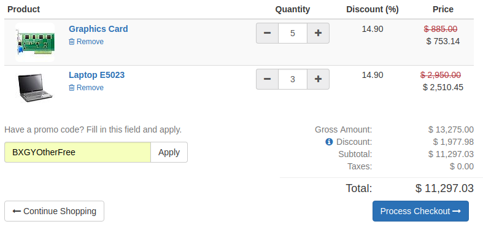

We have entered coupon code ``BXGYOtherFree`` and click on ``Apply`` button. After the click on ``Apply`` 1 more line created with product ``[C-Case] Computer Case`` in sale order line.

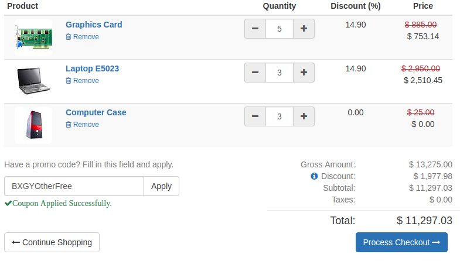

First order line discount calculation
~~~~~~~~~~~~~~~~~~~~~~~~~~~~~~~~~~~~~

- ``Product Lines Rules``

4.9 % of Match first Product Rule Lines (See :ref:`website_price_rule_line`) because ordered Qty 5 is between 1 to 6.

- ``Cart Rules``

First cart Rules (See :ref:`website_cart_rule_line`) don't match because Subtotal is greater than 3,000.00 so that rules skip.

Second Cart Rules (See :ref:`website_cart_rule_line`) match because of Sum of Item Qty at least: 7.00 (here 8). so add 10 %.

.. note::
    Quantity : First order line quantity (5) + Second order line quantity (3)

- ``Coupon Code`` : Coupon code (See :ref:`website_coupon_buy_x_get_y_other`) get y number of other product free.

In this coupon code, we get 3 ``[C-Case] Computer Case`` product free.
**Calculation of third order line** buy every 2 quantity get 1 product free.

``Quantity Calculation:`` **int(Order Line Quantity / Number of X Product)**

- first order line quantity(5):- int(5/2) = 2
- second order line quantity(3):-int(3/2) = 1

``So, the total quantity of third order line is 3.``

- Discount = Product Rule line(**4.9**) + Cart Rules(**10**)

``So, First line discount is 14.9 %( 4.9 + 10) and get free product([C-Case] Computer Case) with 3 Quantity``

Website Sale Orders With Clubbed Discount Coupon Code
-----------------------------------------------------

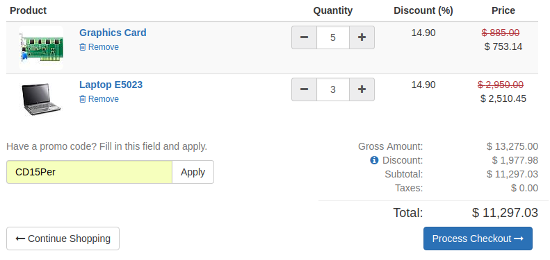

We have entered coupon code ``CD15Per`` and click on ``Apply`` button. After the click on ``Apply`` discount value changed in sale order line.

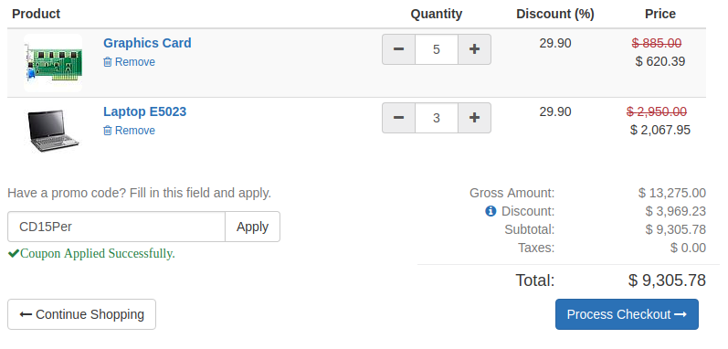

First order line discount calculation
~~~~~~~~~~~~~~~~~~~~~~~~~~~~~~~~~~~~~

- ``Product Lines Rules``

4.9 % of Match first Product Rule Lines (See :ref:`website_price_rule_line`) because ordered Qty 5 is between 1 to 6.

- ``Cart Rules``

First cart Rules (See :ref:`website_cart_rule_line`) don't match because Subtotal is greater than 3,000.00 so that rules skip.

Second Cart Rules (See :ref:`website_cart_rule_line`) match because of Sum of Item Qty at least: 7.00 (here 8). so add 10 %.

.. note::
    Quantity : First order line quantity (5) + Second order line quantity (3)

- ``Coupon Code`` : Coupon code (See :ref:`website_coupon_clubbed`) get 15 percent free.

- Discount = Product Rule line(**4.9**) + Cart Rules(**10**) + Coupon Code(**15**)

``So, First line discount is 29.9 %( 4.9 + 10 + 15)``

.. note::
    Same calculation for the second line of sale order.

Website Sale Orders With Range Based Coupon Code
------------------------------------------------

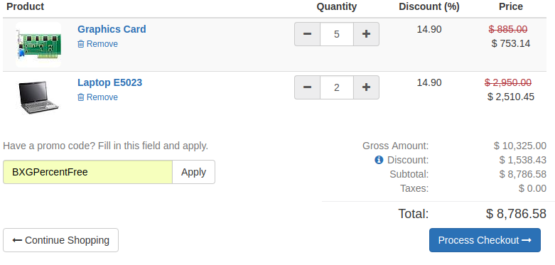

We have entered coupon code ``BXGPercentFree`` and click on ``Apply`` button. After the click on ``Apply`` discount value changed in sale order line.

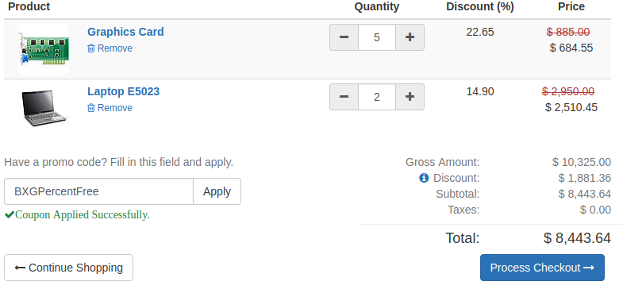

First order line discount calculation
~~~~~~~~~~~~~~~~~~~~~~~~~~~~~~~~~~~~~

- ``Product Lines Rules``

4.9 % of Match first Product Rule Lines (See :ref:`website_price_rule_line`) because ordered Qty 5 is between 1 to 6.

- ``Cart Rules``

First cart Rules (See :ref:`website_cart_rule_line`) don't match because Subtotal is greater than 3,000.00 so that rules skip.

Second Cart Rules (See :ref:`website_cart_rule_line`) match because of Sum of Item Qty at least: 7.00 (here 8). so add 10 %.

.. note::
    Quantity : First order line quantity (5) + Second order line quantity (3)

- ``Coupon Code`` : Coupon code (See :ref:`website_coupon_range_based`) we get 7.75 percent free of buy every 3 qty.

In this coupon code, we get 7.75 percent free of buy every 3 qty.

- Discount = Product Rule line(**4.9**) + Cart Rules(**10**) + Coupon Code(**7.75**)

``So, First line discount is 22.65 %( 4.9 + 10 + 7.75)``

.. note::
    Coupon code does not apply to the second line of sale order because Ordered Qty is less than 3.
